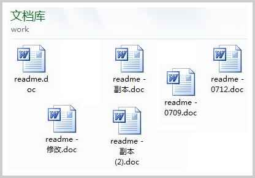

# Git: 最先进的分布式版本控制系统

## 常用工作流程

1. 选择项目的根目录初始化仓库

   ~~~bash
   git init
   ~~~

2. 关联本地git仓库和远程 Github 仓库

   ~~~bash
   git remote add origin <远程仓库URL> #例如git@github.com:guojianjun-ts/Gen-BI.git
   ~~~

3. 添加本地代码至git暂存区

   ~~~bash
   git add . #添加全部文件
   git add <fileName> #添加单文件
   ~~~

4. 提交暂存区文件至git版本库

   ~~~bash
   git commit -m "comment"
   ~~~

5. 推送本地代码到远程 Github 仓库中

   ~~~bash
   git push origin master
   ~~~

   


## 故事背景：

​	没用过Git前，用Word想删除一个段落，又怕将来想把Word恢复但找不回来。这是只能先将Word**另存为**一个’ 新文件 ‘了，用不了多久，你的Word可能就会变成了下图这样的**多个副本**了。



​	过了一周，你想找回被删除的文字，但是已经**记不清**删除前保存在哪个文件里了，只好一个一个文件去找，真麻烦。

​	看着一堆乱七八糟的文件，想保留最新的一个，然后把其他的删掉，又怕哪天会用上，还不敢删，真郁闷。

​	更要命的是，有些部分**需要你的财务同事帮助填写**，于是你把文件Copy到U盘里给她（也可能通过Email发送一份给她），然后，你继续修改Word文件。一天后，同事再把Word文件传给你，此时，你必须想想，发给她之后到你收到她的文件期间，你作了哪些改动，得把你的改动和她的部分合并，真困难。

​	于是你想，如果有一个软件，不但能**自动帮我记录每次文件的改动**，还可以**让同事协作编辑**，这样就不用自己管理一堆类似的文件了，也不需要把文件传来传去。如果想查看某次改动，只需要在软件里瞄一眼就可以，岂不是很方便？

## Git工作区|暂存区|版本库

### 1、工作区（Working Directory）

工作区是你在本地计算机上的项目目录，你在这里进行文件的创建、修改和删除操作。工作区包含了当前项目的所有文件和子目录。

**特点：**

- 显示项目的当前状态。
- 文件的修改在工作区中进行，但这些修改还没有被记录到版本控制中。

### 2、暂存区（Staging Area）

暂存区是一个临时存储区域，它包含了即将被提交到版本库中的文件快照，在提交之前，你可以选择性地将工作区中的修改添加到暂存区。

**特点：**

- 暂存区保存了将被包括在下一个提交中的更改。
- 你可以多次使用 `git add` 命令来将文件添加到暂存区，直到你准备好提交所有更改。

**常用命令：**

~~~shell
git add filename       # 将单个文件添加到暂存区
git add .              # 将工作区中的所有修改添加到暂存区
git status             # 查看哪些文件在暂存区中
~~~

### 3、版本库（Repository）

版本库包含项目的所有版本历史记录。

每次提交都会在版本库中创建一个新的快照，这些快照是不可变的，确保了项目的完整历史记录。

**特点：**

- 版本库分为本地版本库和远程版本库。这里主要指本地版本库。
- 本地版本库存储在 `.git` 目录中，它包含了所有提交的对象和引用。

**常用命令：**

~~~
git commit -m "Commit message"   # 将暂存区的更改提交到本地版本库
git log                          # 查看提交历史
git diff                         # 查看工作区和暂存区之间的差异
git diff --cached                # 查看暂存区和最后一次提交之间的差异
~~~

### 三者关系

**1、工作区 -> 暂存区**

使用 git add 命令将工作区中的修改添加到暂存区。

```
git add filename
# 或者添加所有修改的文件
git add .
```

**2、暂存区 -> 版本库**

使用 git commit 命令将暂存区中的修改提交到版本库。

```
git commit -m "Commit message"
```

**3、版本库 -> 远程仓库**

使用 git push 命令将本地版本库的提交推送到远程仓库。

```
git push origin branch-name
```

**4、远程仓库 -> 本地版本库**

使用 git pull 或 git fetch 命令从远程仓库获取更新。

```
git pull origin branch-name
# 或者
git fetch origin branch-name
git merge origin/branch-name
```

## Git 工作流程

### 1、克隆仓库

如果你要参与一个已有的项目，首先需要将远程仓库克隆到本地：

```
git clone https://github.com/username/repo.git
cd repo
```

### 2、创建新分支

为了避免直接在 main 或 master 分支上进行开发，通常会创建一个新的分支：

```
git checkout -b new-feature
```

### 3、工作目录

在工作目录中进行代码编辑、添加新文件或删除不需要的文件。

### 4、暂存文件

将修改过的文件添加到暂存区，以便进行下一步的提交操作：

```
git add filename
# 或者添加所有修改的文件
git add .
```

### 5、提交更改

将暂存区的更改提交到本地仓库，并添加提交信息：

```
git commit -m "Add new feature"
```

### 6、拉取最新更改

在推送本地更改之前，最好从远程仓库拉取最新的更改，以避免冲突：

```
git pull origin main
# 或者如果在新的分支上工作
git pull origin new-feature
```

### 7、推送更改

将本地的提交推送到远程仓库：

```
git push origin new-feature
```

### 8、创建 Pull Request（PR）

在 GitHub 或其他托管平台上创建 Pull Request，邀请团队成员进行代码审查。PR 合并后，你的更改就会合并到主分支。

### 9、合并更改

在 PR 审核通过并合并后，可以将远程仓库的主分支合并到本地分支：

```
git checkout main
git pull origin main
git merge new-feature
```

### 10、删除分支

如果不再需要新功能分支，可以将其删除：

```
git branch -d new-feature
```

或者从远程仓库删除分支：

```
git push origin --delete new-feature
```

## Git常见用法

~~~
git init - 初始化仓库。
git add . - 添加文件到暂存区。
git commit - 将暂存区内容添加到仓库中。
~~~

### 创建仓库命令

下表列出了 git 创建仓库的命令：

| 命令        | 说明                                   |
| :---------- | :------------------------------------- |
| `git init`  | 初始化仓库                             |
| `git clone` | 拷贝一份远程仓库，也就是下载一个项目。 |

------

### 提交与修改

Git 的工作就是创建和保存你的项目的快照及与之后的快照进行对比。

下表列出了有关创建与提交你的项目的快照的命令：

| 命令                                | 说明                                     |
| :---------------------------------- | :--------------------------------------- |
| `git add`                           | 添加文件到暂存区                         |
| `git status`                        | 查看仓库当前的状态，显示有变更的文件。   |
| `git diff`                          | 比较文件的不同，即暂存区和工作区的差异。 |
| `git difftool`                      | 使用外部差异工具查看和比较文件的更改。   |
| `git range-diff`                    | 比较两个提交范围之间的差异。             |
| `git commit`                        | 提交暂存区到本地仓库。                   |
| `git reset`                         | 回退版本。                               |
| `git rm`                            | 将文件从暂存区和工作区中删除。           |
| `git mv`                            | 移动或重命名工作区文件。                 |
| `git notes`                         | 添加注释。                               |
| `git checkout`                      | 分支切换。                               |
| `git switch （Git 2.23 版本引入）`  | 更清晰地切换分支。                       |
| `git restore （Git 2.23 版本引入）` | 恢复或撤销文件的更改。                   |
| `git show`                          | 显示 Git 对象的详细信息。                |

### 提交日志

| 命令               | 说明                                                         |
| :----------------- | :----------------------------------------------------------- |
| `git log`          | 查看历史提交记录                                             |
| `git blame <file>` | 以列表形式查看指定文件的历史修改记录                         |
| `git shortlog`     | 生成简洁的提交日志摘要                                       |
| `git describe`     | 生成一个可读的字符串，该字符串基于 Git 的标签系统来描述当前的提交 |

### 远程操作

| 命令            | 说明                        |
| :-------------- | :-------------------------- |
| `git remote`    | 远程仓库操作                |
| `git fetch`     | 从远程获取代码库            |
| `git pull`      | 下载远程代码并合并          |
| `git push`      | 上传远程代码并合并          |
| `git submodule` | 管理包含其他 Git 仓库的项目 |