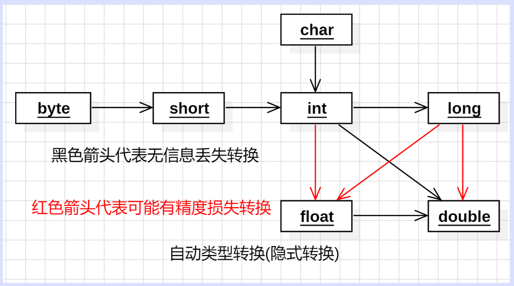

# Java八股学习

##  Java基础

### Java基础概念与常识

#### Java的优势(特点)是什么？

1. 简单易学（语法简单，上手容易）
2. 面对对象（具有封装、继承、多态）的特性
3. 平台无关性（由Java虚拟机实现）
4. 支持多线程（不像C++因为没有内置多线程机制，必须调用操作系统的多线程功能来实现多线程的设计，Java语言本身提供了多线程的支持）
5. 可靠性（具备异常处理和自动内存管理机制）
6. 安全性（语言设计的本身提供了多重安全保护机制：访问权限修饰符、限制程序直接访问系统资源等）
7. 高效性（通过JIT编译器等技术的优化，Java语言运行效率高）
8. 支持网络编程且很方便
9. 编译与解释并存

#### JVM、JDK、JRE三者关系？

1. `JVM`是运行Java字节码的虚拟机，然后JVN针对不同系统有特定的实现，目的是运行相同的字节码，JVM都会有相同的输出。而字节码与JVM正是实现Java“一次编译，处处运行”的关键所在。
2. `JDK`则是指一个功能齐全的Java开发工具包，供开发者使用，提供了开发、编译、调试、运行Java程序所需的全部工具和环境。包含了JRE、编译器javac、和其他工具（javadoc（文档生成器）、jdb（调试器）、jconsole（监控工具）、javap（反汇编））
3. `JRE`指运行已编译Java程序所需的环境主要包括了JVM和Java基础类库(Class Library)（一组标准的类库，提供常用的功能和API（如I/O操作、网络通信、数据结构等））

#### 为什么说Java“编译与解释共存”？

1. 编译型：编译型语言指通过编译器，将整个源代码一次编译为该平台可执行的机器码。一般情况下，编译语言的执行速度快，开发效率低，跨平台性差。
2. 解释型：解释型语言指由解释器逐行解释代码为机器码后再执行。一般情况下，解释型语言的执行速度慢，开发效率高，跨平台性强。
3. “编译与解释共存”：这是因为Java语言不仅具有编译型语言的特点也有解释型语言的特点。因为Java源程序要先经过编译器编译为字节码(.class)文件，这种字节码文件必须再通过Java解释器来解释执行。

### 基本数据类型

#### Java都有哪些什么数据类型？

1. 首先Java的数据类型可以分为两大类：基本数据类型和引用数据类型。
   - 基本数据类型又可以分为：
     - 6 种数字类型：
       - 4 种整数型：`byte`、`short`、`int`、`long`
       - 2 种浮点型：`float`、`double`
     - 1 种字符类型：`char`（2字节）
     - 1 种布尔型：`boolea n`
   - 引用数据类型：`class`、`interface` 、`数组` 

#### 你知道哪些数据类型的转换方式呢？

1. 自动类型转换（隐式转换）

   指当目标类型的范围大于源类型时，Java会自动将源类型转换为目标类型，不需要显式的类型转换。
   

2. 强制类型转换（显式转换）

   指当目标类型的范围小于源类型时，通过强制类型转换将源类型转换为目标类型。但是可能导致数据丢失或溢出。

3. 字符串转换

   指通过Java提供的方法（如Integer.parseInt()、Double.parseDouble()等）将字符串表示的数据转换为其他类型数据。

4. 数值之间转换

   指通过Java提供的一些数值类型之间的转换方法（通过类型的包装类来实现）将整型转换成字符型、字符型转换为整型等。

#### 那么类型互转可能会有什么问题呢？

1. 数据丢失：当将一个范围较大的数据类型转换为一个范围较小的数据类型时，可能会发生数据丢失。如long->int，高位丢失。
2. 数据溢出：当将一个范围较小的数据类型转换为一个范围较大的数据类型时，可能会发生数据溢出。如int->long ，填补高位。
3. 精度损失：由于浮点数的表示方式不同，当将一个float类型转换为一个double类型时，精度可能会丢失。
4. 类型不匹配导致的错误：假如目标类型和源类型不兼容，会导致编译错误或运行时错误。

#### 了解基本数据类型和包装类型的区别吗？

1. 用途方面：基本类型常用于对性能要求较高、追求简单高效数据存储的场景，如方法内的局部变量、简单的数值计算等；包装类型由于其对象特性，常用于需要使用对象方法的场景，如集合类存储元素、泛型编程以及需要利用对象方法进行复杂操作的场景
2. 存储方式：
   - 基本数据类型：
     - 局部变量：存放在JVM栈中的局部变量表中。
     - 成员变量(未被static修饰)：存放在JVM的堆中。
     - 静态成员变量：在JDK 1.7 及之前存放于方法区，1.8 后存放于元空间，均不存放于堆中。
   - 包装类型：包装类型属于对象类型，因此存放在JVM堆中。
3. 占用空间：相比于包装类型，基本数据类型的占用空间往往很小（如`int`占4字节，而`Integer`占16字节）。
4. 默认值：基本数据类型都有对应的默认值，而包装类型不赋值的话就是null。
5. 比较方式：
   - 基本数据类型：使用`==` 比较的是值。
   - 包装数据类型： 
     - 使用`==` 比较的是对象的内存地址，不过由于缓存机制，在 **[-128，127]** 区间内的Integer值也可以使用`==`来进行判断。
     - 使用 `equals()` 比较整型包装类对象之间的值。

#### 包装类型的缓存机制了解吗？

1. Java基本数据类型的包装类型中大部分都使用了缓存机制来提升性能，浮点数类型的包装类没有实现缓存机制。
   1. 整型包装类：`Byte`,`Short`,`Integer`,`Long` 这 4 种包装类默认创建了数值 **[-128，127]** 的相应类型的缓存数据。
   2. 字符包装类：`Character` 创建了数值在 **[0,127]** 范围的缓存数据。
   3. 布尔包装类：`Boolean` 直接返回 `True` or `False`。

#### 装箱和拆箱是什么？

1. **装箱**：将基本类型用它们对应的引用类型包装起来，调用包装类的 `valueOf()`方法。

2. **拆箱**：将包装类型转换为基本数据类型，调用包装类的 `xxxValue()`方法。

   ~~~java
   Integer i = 10;  //装箱
   int n = i;   //拆箱
   ~~~

3. 自动装箱主要发生在两种情况，一种是赋值时，另一种是在方法调用的时候。

4. 频繁的装箱拆箱（循环操作）会严重的影响系统的性能（创建很多的包装类对象），尽量避免不必要的装拆箱操作。

#### 讲讲Integer的缓存池呢？

​	Java的Integer缓存池是为了提升性能和节省内存。根据实践，发现大部分的数据操作都集中在值比较小的范围因此缓存这些对象可以减少内存分配和垃圾回收的负担，提升性能。在-128到127访问内的Integer对象会被缓存和复用。
原理:

- Java在自动装箱时，对于值在-128到127之间的int类型，会直接返回一个已经缓存的lnteger对象，而不是创建新的对象。
- 缓存池的使用场景:
  - 自动装箱(Auto-boxing):当基本类型int转换为包装类Integer时，若数值在缓存范围内，返回缓存对象。
  - 值比较:由于相同范围内的整数使用同一个缓存对象，使用== 可以正确比较它们的地址(引用地址相同)，而不需要使用equals(),但是要注意对于超过缓存范围的Integer对象，==比较的是对象引用，而不是数值。要比较数值，应该使用equals()方法。

#### 浮点数运算时为什么会有精度丢失的风险？

​	这主要与计算机保存浮点数的机制有关，因为计算机是二进制的，而计算机在表示一个无线循环的数时，由于宽度有限的缘故会导致无线循环小数被截断，从而发生精度丢失的情况。

#### 那么BigDecimal为什么能保证精度不丢失呢？

1. 首先是大十进制方法采用了表示任意精度的整数表示法。
2. 整数表示法：使用int[ ]数组和表示小数点的scale字段分开存储`整数部分`和`存储小数点的位置` 。
3. BigDecimal的特点：
   1. 属于java.math包，提供对浮点数和定点数的精度控制，适用于科学计算或金融等需要高精度的领域。
   2. 高精度：可以处理任意精度的数，不像float或double存在精度限制。
   3. 不可变性：是不可变类，所有的算术运算都会返回新的BigDecimal对象，而不会改变原有的对象。
   4. 丰富的功能：提供了加、减、乘、除、取余、舍入、比较等多种方法和不同舍入模式。
4. 推荐使用字符串创建BigDecimal对象，因为字符串可以精确表示数值，而浮点数本身有精度问题。

### 变量

#### 成员变量与局部变量的区别？

- **语法形式**：从语法形式上看，成员变量是属于类的，而局部变量是在代码块或方法中定义的变量或是方法的参数；成员变量可以被 `public`,`private`,`static` 等修饰符所修饰，而局部变量不能被访问控制修饰符及 `static` 所修饰；但是，成员变量和局部变量都能被 `final` 所修饰。
- **存储方式**：从变量在内存中的存储方式来看，如果成员变量是使用 `static` 修饰的，那么这个成员变量是属于类的，如果没有使用 `static` 修饰，这个成员变量是属于实例的。而对象存在于堆内存，局部变量则存在于栈内存。
- **生存时间**：从变量在内存中的生存时间上看，成员变量是对象的一部分，它随着对象的创建而存在，而局部变量随着方法的调用而自动生成，随着方法的调用结束而消亡。
- **默认值**：从变量是否有默认值来看，成员变量如果没有被赋初始值，则会自动以类型的默认值而赋值（一种情况例外:被 `final` 修饰的成员变量也必须显式地赋值），而局部变量则不会自动赋值。

#### 静态变量有什么作用？

​	静态变量是被`static` 修饰的变量。它可以被类的所有实例共享，无论一个类创建了多少个对象，它们都共享同一份静态变量。也就是说，静态变量只会被分配一次内存，即使创建多个对象，这样可以节省内存。

### 方法

#### 静态方法和实例方法有何不同？

|          |          静态方法          |                    实例方法                    |
| :------: | :------------------------: | :--------------------------------------------: |
|  关键字  |           static           |                       无                       |
|   归属   |             类             |                      对象                      |
| 调用方式 | 通过类名或对象调用(不建议) |                  通过对象调用                  |
| 访问权限 | 只能访问静态变量和静态方法 | 可以访问实例变量、实例方法、静态变量和静态方法 |
| 典型用途 |    工具类方法、工厂方法    |     操作对象实例变量、与对象状态相关的操作     |
| 生命周期 | 类加载时存在，类卸载时消失 |         对象创建时存在，对象销毁时消失         |

#### 方法的重载和重写有什么不同？

- 重载(Overloading)指的是在 **同一个类** 中，可以有多个同名方法，它们具有不同的参数列表(参数类型、参数个数或参数顺序不同)，编译器根据调用时的参数类型来决定调用哪个方法。

- 重写(Overriding)指的是 **子类 **可以重新定义 **父类** 中的方法，方法名、参数列表和返回类型必须与父类中的方法一致，通过@override注解来明确表示这是对父类方法的重写。

- **总结：重写就是子类对父类方法的重新改造，外部样子不能改变，内部逻辑可以改变。**

  |   区别点   | 重载方法 | 重写方法                                                     |
  | :--------: | :------: | :----------------------------------------------------------- |
  |  发生范围  | 同一个类 | 子类                                                         |
  |  参数列表  | 必须修改 | 一定不能修改                                                 |
  |  返回类型  |  可修改  | 子类方法返回值类型应比父类方法返回值类型更小或相等           |
  |    异常    |  可修改  | 子类方法声明抛出的异常类应比父类方法声明抛出的异常类更小或相等； |
  | 访问修饰符 |  可修改  | 一定不能做更严格的限制（可以降低限制）                       |
  |  发生阶段  |  编译期  | 运行期                                                       |

  **方法的重写要遵循“两同两小一大”**：

  - “两同”即方法名相同、形参列表相同；
  - “两小”指的是子类方法返回值类型应比父类方法返回值类型更小或相等，子类方法声明抛出的异常类应比父类方法声明抛出的异常类更小或相等；
  - “一大”指的是子类方法的访问权限应比父类方法的访问权限更大或相等。

### 面对对象编程

- 你是怎么理解面对对象的呢？
- 讲讲Java中面向对象的三大特性呢？
- 重载和重写的区别？
- 抽象类和实体类的区别是什么？
- 那么抽象类和接口的区别是什么呢?
- 深拷贝和浅拷贝的区别？引用拷贝又是什么呢？