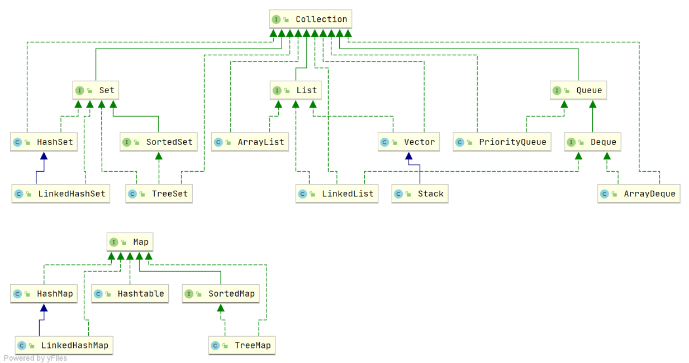

# Java八股学习

##  Java基础

### Java基础概念与常识

#### Java的优势(特点)是什么？

1. 简单易学（语法简单，上手容易）
2. 面对对象（具有封装、继承、多态）的特性
3. 平台无关性（由Java虚拟机实现）
4. 支持多线程（不像C++因为没有内置多线程机制，必须调用操作系统的多线程功能来实现多线程的设计，Java语言本身提供了多线程的支持）
5. 可靠性（具备异常处理和自动内存管理机制）
6. 安全性（语言设计的本身提供了多重安全保护机制：访问权限修饰符、限制程序直接访问系统资源等）
7. 高效性（通过JIT编译器等技术的优化，Java语言运行效率高）
8. 支持网络编程且很方便
9. 编译与解释并存

#### JVM、JDK、JRE三者关系？

1. `JVM`是运行Java字节码的虚拟机，然后JVN针对不同系统有特定的实现，目的是运行相同的字节码，JVM都会有相同的输出。而字节码与JVM正是实现Java“一次编译，处处运行”的关键所在。
2. `JDK`则是指一个功能齐全的Java开发工具包，供开发者使用，提供了开发、编译、调试、运行Java程序所需的全部工具和环境。包含了JRE、编译器javac、和其他工具（javadoc（文档生成器）、jdb（调试器）、jconsole（监控工具）、javap（反汇编））
3. `JRE`指运行已编译Java程序所需的环境主要包括了JVM和Java基础类库(Class Library)（一组标准的类库，提供常用的功能和API（如I/O操作、网络通信、数据结构等））

#### 为什么说Java“编译与解释共存”？

1. 编译型：编译型语言指通过编译器，将整个源代码一次编译为该平台可执行的机器码。一般情况下，编译语言的执行速度快，开发效率低，跨平台性差。
2. 解释型：解释型语言指由解释器逐行解释代码为机器码后再执行。一般情况下，解释型语言的执行速度慢，开发效率高，跨平台性强。
3. “编译与解释共存”：这是因为Java语言不仅具有编译型语言的特点也有解释型语言的特点。因为Java源程序要先经过编译器编译为字节码(.class)文件，这种字节码文件必须再通过Java解释器来解释执行。

------

### 基本数据类型

#### Java都有哪些什么数据类型？

1. 首先Java的数据类型可以分为两大类：基本数据类型和引用数据类型。
   - 基本数据类型又可以分为：
     - 6 种数字类型：
       - 4 种整数型：`byte`、`short`、`int`、`long`
       - 2 种浮点型：`float`、`double`
     - 1 种字符类型：`char`（2字节）
     - 1 种布尔型：`boolea n`
   - 引用数据类型：`class`、`interface` 、`数组` 

#### 你知道哪些数据类型的转换方式呢？

1. 自动类型转换（隐式转换）

   指当目标类型的范围大于源类型时，Java会自动将源类型转换为目标类型，不需要显式的类型转换。
   

2. 强制类型转换（显式转换）

   指当目标类型的范围小于源类型时，通过强制类型转换将源类型转换为目标类型。但是可能导致数据丢失或溢出。

3. 字符串转换

   指通过Java提供的方法（如Integer.parseInt()、Double.parseDouble()等）将字符串表示的数据转换为其他类型数据。

4. 数值之间转换

   指通过Java提供的一些数值类型之间的转换方法（通过类型的包装类来实现）将整型转换成字符型、字符型转换为整型等。

#### 那么类型互转可能会有什么问题呢？

1. 数据丢失：当将一个范围较大的数据类型转换为一个范围较小的数据类型时，可能会发生数据丢失。如long->int，高位丢失。
2. 数据溢出：当将一个范围较小的数据类型转换为一个范围较大的数据类型时，可能会发生数据溢出。如int->long ，填补高位。
3. 精度损失：由于浮点数的表示方式不同，当将一个float类型转换为一个double类型时，精度可能会丢失。
4. 类型不匹配导致的错误：假如目标类型和源类型不兼容，会导致编译错误或运行时错误。

#### 了解基本数据类型和包装类型的区别吗？

1. 用途方面：基本类型常用于对性能要求较高、追求简单高效数据存储的场景，如方法内的局部变量、简单的数值计算等；包装类型由于其对象特性，常用于需要使用对象方法的场景，如集合类存储元素、泛型编程以及需要利用对象方法进行复杂操作的场景
2. 存储方式：
   - 基本数据类型：
     - 局部变量：存放在JVM栈中的局部变量表中。
     - 成员变量(未被static修饰)：存放在JVM的堆中。
     - 静态成员变量：在JDK 1.7 及之前存放于方法区，1.8 后存放于元空间，均不存放于堆中。
   - 包装类型：包装类型属于对象类型，因此存放在JVM堆中。
3. 占用空间：相比于包装类型，基本数据类型的占用空间往往很小（如`int`占4字节，而`Integer`占16字节）。
4. 默认值：基本数据类型都有对应的默认值，而包装类型不赋值的话就是null。
5. 比较方式：
   - 基本数据类型：使用`==` 比较的是值。
   - 包装数据类型： 
     - 使用`==` 比较的是对象的内存地址，不过由于缓存机制，在 **[-128，127]** 区间内的Integer值也可以使用`==`来进行判断。
     - 使用 `equals()` 比较整型包装类对象之间的值。

#### 包装类型的缓存机制了解吗？

1. Java基本数据类型的包装类型中大部分都使用了缓存机制来提升性能，浮点数类型的包装类没有实现缓存机制。
   1. 整型包装类：`Byte`,`Short`,`Integer`,`Long` 这 4 种包装类默认创建了数值 **[-128，127]** 的相应类型的缓存数据。
   2. 字符包装类：`Character` 创建了数值在 **[0,127]** 范围的缓存数据。
   3. 布尔包装类：`Boolean` 直接返回 `True` or `False`。

#### 装箱和拆箱是什么？

1. **装箱**：将基本类型用它们对应的引用类型包装起来，调用包装类的 `valueOf()`方法。

2. **拆箱**：将包装类型转换为基本数据类型，调用包装类的 `xxxValue()`方法。

   ~~~java
   Integer i = 10;  //装箱
   int n = i;   //拆箱
   ~~~

3. 自动装箱主要发生在两种情况，一种是赋值时，另一种是在方法调用的时候。

4. 频繁的装箱拆箱（循环操作）会严重的影响系统的性能（创建很多的包装类对象），尽量避免不必要的装拆箱操作。

#### 讲讲Integer的缓存池呢？

​	Java的Integer缓存池是为了提升性能和节省内存。根据实践，发现大部分的数据操作都集中在值比较小的范围因此缓存这些对象可以减少内存分配和垃圾回收的负担，提升性能。在-128到127访问内的Integer对象会被缓存和复用。
原理:

- Java在自动装箱时，对于值在-128到127之间的int类型，会直接返回一个已经缓存的lnteger对象，而不是创建新的对象。
- 缓存池的使用场景:
  - 自动装箱(Auto-boxing):当基本类型int转换为包装类Integer时，若数值在缓存范围内，返回缓存对象。
  - 值比较:由于相同范围内的整数使用同一个缓存对象，使用== 可以正确比较它们的地址(引用地址相同)，而不需要使用equals(),但是要注意对于超过缓存范围的Integer对象，==比较的是对象引用，而不是数值。要比较数值，应该使用equals()方法。

#### 浮点数运算时为什么会有精度丢失的风险？

​	这主要与计算机保存浮点数的机制有关，因为计算机是二进制的，而计算机在表示一个无线循环的数时，由于宽度有限的缘故会导致无线循环小数被截断，从而发生精度丢失的情况。

#### 那么BigDecimal为什么能保证精度不丢失呢？

1. 首先是大十进制方法采用了表示任意精度的整数表示法。
2. 整数表示法：使用int[ ]数组和表示小数点的scale字段分开存储`整数部分`和`存储小数点的位置` 。
3. BigDecimal的特点：
   1. 属于java.math包，提供对浮点数和定点数的精度控制，适用于科学计算或金融等需要高精度的领域。
   2. 高精度：可以处理任意精度的数，不像float或double存在精度限制。
   3. 不可变性：是不可变类，所有的算术运算都会返回新的BigDecimal对象，而不会改变原有的对象。
   4. 丰富的功能：提供了加、减、乘、除、取余、舍入、比较等多种方法和不同舍入模式。
4. 推荐使用字符串创建BigDecimal对象，因为字符串可以精确表示数值，而浮点数本身有精度问题。

------

### 变量

#### 成员变量与局部变量的区别？

- **语法形式**：从语法形式上看，成员变量是属于类的，而局部变量是在代码块或方法中定义的变量或是方法的参数；成员变量可以被 `public`,`private`,`static` 等修饰符所修饰，而局部变量不能被访问控制修饰符及 `static` 所修饰；但是，成员变量和局部变量都能被 `final` 所修饰。
- **存储方式**：从变量在内存中的存储方式来看，如果成员变量是使用 `static` 修饰的，那么这个成员变量是属于类的，如果没有使用 `static` 修饰，这个成员变量是属于实例的。而对象存在于堆内存，局部变量则存在于栈内存。
- **生存时间**：从变量在内存中的生存时间上看，成员变量是对象的一部分，它随着对象的创建而存在，而局部变量随着方法的调用而自动生成，随着方法的调用结束而消亡。
- **默认值**：从变量是否有默认值来看，成员变量如果没有被赋初始值，则会自动以类型的默认值而赋值（一种情况例外:被 `final` 修饰的成员变量也必须显式地赋值），而局部变量则不会自动赋值。

#### 静态变量有什么作用？

​	静态变量是被`static` 修饰的变量。它可以被类的所有实例共享，无论一个类创建了多少个对象，它们都共享同一份静态变量。也就是说，静态变量只会被分配一次内存，即使创建多个对象，这样可以节省内存。

------

### 方法

#### 静态方法和实例方法有何不同？

|          |          静态方法          |                    实例方法                    |
| :------: | :------------------------: | :--------------------------------------------: |
|  关键字  |           static           |                       无                       |
|   归属   |             类             |                      对象                      |
| 调用方式 | 通过类名或对象调用(不建议) |                  通过对象调用                  |
| 访问权限 | 只能访问静态变量和静态方法 | 可以访问实例变量、实例方法、静态变量和静态方法 |
| 典型用途 |    工具类方法、工厂方法    |     操作对象实例变量、与对象状态相关的操作     |
| 生命周期 | 类加载时存在，类卸载时消失 |         对象创建时存在，对象销毁时消失         |

#### 方法的重载和重写有什么不同？

- 重载(Overloading)指的是在 **同一个类** 中，可以有多个同名方法，它们具有不同的参数列表(参数类型、参数个数或参数顺序不同)，编译器根据调用时的参数类型来决定调用哪个方法。

- 重写(Overriding)指的是 **子类 **可以重新定义 **父类** 中的方法，方法名、参数列表和返回类型必须与父类中的方法一致，通过@override注解来明确表示这是对父类方法的重写。

- **总结：重写就是子类对父类方法的重新改造，外部样子不能改变，内部逻辑可以改变。**

  |   区别点   | 重载方法 | 重写方法                                                     |
  | :--------: | :------: | :----------------------------------------------------------- |
  |  发生范围  | 同一个类 | 子类                                                         |
  |  参数列表  | 必须修改 | 一定不能修改                                                 |
  |  返回类型  |  可修改  | 子类方法返回值类型应比父类方法返回值类型更小或相等           |
  |    异常    |  可修改  | 子类方法声明抛出的异常类应比父类方法声明抛出的异常类更小或相等； |
  | 访问修饰符 |  可修改  | 一定不能做更严格的限制（可以降低限制）                       |
  |  发生阶段  |  编译期  | 运行期                                                       |

  **方法的重写要遵循“两同两小一大”**：

  - “两同”即方法名相同、形参列表相同；
  - “两小”指的是子类方法返回值类型应比父类方法返回值类型更小或相等，子类方法声明抛出的异常类应比父类方法声明抛出的异常类更小或相等；
  - “一大”指的是子类方法的访问权限应比父类方法的访问权限更大或相等。

------

### 面向对象编程

#### 你是怎么理解面向对象的呢？

面对对象编程(OOP)是一种编程范式，将世间万物抽象为对象，并为对象赋予属性和行为，通过用对象执行方法的方式来解决问题。相较于面对过程编程(POP)一般有以下的优点：

1. **易维护**：由于良好的结构和封装性，OOP 程序通常更容易维护。
2. **易复用**：通过继承和多态，OOP 设计使得代码更具复用性，方便扩展功能。
3. **易扩展**：模块化设计使得系统扩展变得更加容易和灵活。

#### 讲讲Java中面向对象的三大特性呢？

Java面向对象的三大特性有：封装、继承、多态。

1. **封装（Encapsulation）**

   定义：封装是指将对象的属性和行为（数据和方法）包装在一起，并对外隐藏内部实现细节，只通过公开的接口与外界交互。

   **作用**：

   - **安全性**：通过访问控制（如 `private`、`protected`、`public`），保护数据不被外部直接修改。
   - **简化使用**：用户只需要知道如何调用方法，而不需要关心内部实现细节。
   - **可维护性**：修改内部实现时，不会影响外部调用代码。

2. **继承（Inheritance）**

   **定义**：
   继承是指一个类（子类）可以基于另一个类（父类）创建，并自动获得父类的属性和方法，同时可以扩展或重写这些属性和方法。

   **作用**：

   - **代码复用**：子类可以直接复用父类的代码，减少重复编写。
   - **扩展性**：子类可以在父类的基础上添加新的功能或修改现有功能。
   - **层次化设计**：通过继承关系，可以更好地组织和管理代码。

3. **多态（Polymorphism）**

   **定义**：
   多态是指同一个方法在不同对象中具有不同的实现方式。多态分为 ​**编译时多态**​（方法重载）和 ​**运行时多态**​（方法重写）。

   **作用**：

   - **灵活性**：同一个方法可以根据对象类型的不同表现出不同的行为。
   - **解耦**：调用方不需要知道具体实现细节，只需要知道接口或父类即可。
   - **可扩展性**：新增子类时，无需修改现有代码。

#### 重载和重写的区别？

- 重载指的是同一个类中，可以有多个同名的方法，但是他们具有不同的参数列表，编译器根据调用时的参数类型来决定调用哪个方法。
- 重写指的是子类通过@override注解来重写父类中的方法，但是方法名、参数列表和返回类型必须与父类中的方法一致。

#### 抽象类和普通类的区别是什么？

- 普通类是一个具体定义的类，可以包含具体的属性和行为，并且可以直接实例化对象。

- 抽象类通过`abstract`声明，是一个不能被实例化的类，通常作为其他类的基类。可以包含抽象方法，用于强制子类实现方法。

  ### **总结**

  |      特性      |          普通类          |                抽象类                |
  | :------------: | :----------------------: | :----------------------------------: |
  |   **实例化**   |      可以直接实例化      |  不能直接实例化，只能通过子类实例化  |
  |  **方法实现**  |  所有方法必须有具体实现  |      可以包含抽象方法和具体方法      |
  |  **设计目的**  |    定义具体对象和行为    | 定义模板或规范，强制子类实现某些行为 |
  | **继承与扩展** | 子类可以选择是否重写方法 |       子类必须实现所有抽象方法       |
  |  **适用场景**  |    直接使用，行为明确    |     作为基类，需要子类扩展或实现     |

#### 抽象类和接口的共同点和区别?

1. #### 接口和抽象类的共同点

   - **不能实例化**：接口和抽象类都不能直接实例化，只能被实现（接口）或继承（抽象类）后才能创建具体的对象。

   - **可以有抽象方法**：接口和抽象类都可以包含抽象方法。抽象方法没有方法体，必须在子类或实现类中实现。

2. 接口和抽象类的区别

   - **设计目的**：
     - **接口：**接口的设计是自上向下的。我们先知晓某一通用行为，并基于这一行为约束定义了接口，一旦类要有这些行为，就要去实现对应的接口。

     - **抽象类：**抽象类的设计是自下向上的。我们先写了很多类，发掘出他们之间的共性，发现有很多的代码可以复用，因此将公共逻辑封装为一抽象类，减少代码冗余。

   - **继承和实现**：
     - **接口：**可以实现多个接口，一个接口也可以继承多个其他接口。

     - **抽象类：**只能继承一个抽象类，因为 Java 不支持多继承。

   - **构造函数和成员变量**：
     - **接口:**  不能包含构造函数，成员变量默认为：`public static final` ，即常量。

     - **抽象类:**  可以包含构造函数，成员变量可以有不同的访问修饰符（`private`, `protected`, `public`），可以不为常量。

   - **方法实现：**
     - **接口：**Java 8 之前，接口中的方法默认是 `public abstract` ，也就是只能有方法声明。自 Java 8 起，可以在接口中定义 `default`（默认） 方法和 `static` （静态）方法。 自 Java 9 起，接口可以包含 `private` 方法。
     - **抽象类：**可以包含抽象方法和非抽象方法。抽象方法没有方法体，必须在子类中实现。非抽象方法有具体实现，可以直接在抽象类中使用或在子类中重写。

#### 深拷贝和浅拷贝的区别？

- 浅拷贝：创建一个新的对象，并将原对象的**非静态字段**复制到新对象中。如果字段是**基本类型**，则直接复制值；如果字段是**引用类型**，则复制引用（即拷贝对象和原对象共享同一个内部对象）。
- 深拷贝：指指创建一个新对象，并将原对象的**所有字段**复制到新对象中。对于引用类型的字段，会递归地复制其指向的对象，而不是仅仅复制引用。

#### 实现深拷贝的方法？

主要有三种方法：

- 实现 Cloneable 接口并重写 clone() 方法
- 使用序列化和反序列化：通过将对象序列化为字节流，再从字节流反序列化为对象来实现深拷贝。
- 手动递归复制

------

### 对象(Object)和Object 根类

####  java创建对象有哪些方式？

- 通过new来建立一个对象
- 通过反射机制，使用Class类的newInstance()方法来创建一个对象
- 同样是通过反射机制，可以**使用Constructor类的newInstance()方法**来创建一个对象
- **使用clone()方法**：如果类实现了Cloneable接口，可以使用clone()方法复制对象。
- **使用反序列化**：通过将对象序列化到文件或流中，然后再进行反序列化来创建对象。

#### Object 类的常见方法有哪些？

~~~java
/**
 * native 方法，用于返回当前运行时对象的 Class 对象，使用了 final 关键字修饰，故不允许子类重写。
 */
public final native Class<?> getClass()
/**
 * native 方法，用于返回对象的哈希码，主要使用在哈希表中，比如 JDK 中的HashMap。
 */
public native int hashCode()
/**
 * 用于比较 2 个对象的内存地址是否相等，String 类对该方法进行了重写以用于比较字符串的值是否相等。
 */
public boolean equals(Object obj)
/**
 * native 方法，用于创建并返回当前对象的一份拷贝。
 */
protected native Object clone() throws CloneNotSupportedException
/**
 * 返回类的名字实例的哈希码的 16 进制的字符串。建议 Object 所有的子类都重写这个方法。
 */
public String toString()
/**
 * native 方法，并且不能重写。唤醒一个在此对象监视器上等待的线程(监视器相当于就是锁的概念)。如果有多个线程在等待只会任意唤醒一个。
 */
public final native void notify()
/**
 * native 方法，并且不能重写。跟 notify 一样，唯一的区别就是会唤醒在此对象监视器上等待的所有线程，而不是一个线程。
 */
public final native void notifyAll()
/**
 * native方法，并且不能重写。暂停线程的执行。注意：sleep 方法没有释放锁，而 wait 方法释放了锁 ，timeout 是等待时间。
 */
public final native void wait(long timeout) throws InterruptedException
/**
 * 多了 nanos 参数，这个参数表示额外时间（以纳秒为单位，范围是 0-999999）。 所以超时的时间还需要加上 nanos 纳秒。。
 */
public final void wait(long timeout, int nanos) throws InterruptedException
/**
 * 跟之前的2个wait方法一样，只不过该方法一直等待，没有超时时间这个概念
 */
public final void wait() throws InterruptedException
/**
 * 实例被垃圾回收器回收的时候触发的操作
 */
protected void finalize() throws Throwable { }
~~~

#### == 和 equals() 的区别？

1. 对于 `==`来说，`==`对于基本类型和引用类型是不同的
   - 对于基本数据类型来说，`==` 比较的是值。
   - 对于引用数据类型来说，`==` 比较的是对象的内存地址。
2. 对于`equals()`来说，因为它存在与Object类中，而所有的类都直接或间接继承于Object类，因此所有的类都有`equals()`方法，以下为`equals()`的两种使用情况：
   - **类没有重写 `equals()`方法**：通过`equals()`比较该类的两个对象时，比较的是两个对象的引用，即两个对象是否指向同一个内存地址，等价于通过 `==` 比较这两个对象。
   - **类重写了 `equals()`方法**：一般我们都重写 `equals()`方法来比较两个对象中的属性是否相等；若它们的属性相等，则返回 true(即，认为这两个对象相等)。

#### hashCode( )有什么用？

​	`hashCode()` 的作用是获取哈希码（`int` 整数），也称为散列码。这个哈希码的作用是确定该对象在哈希表中的索引位置。

#### 为什么要有 hashCode？

​	以“`HashSet` 如何检查重复”为例子来说明为什么要有 `hashCode`? 这个问题

- 如果两个对象的`hashCode` 值相等，那这两个对象不一定相等（哈希碰撞）。

- 如果两个对象的`hashCode` 值相等并且`equals()`方法也返回 `true`，我们才认为这两个对象相等。

- 如果两个对象的`hashCode` 值不相等，我们就可以直接认为这两个对象不相等。

  因此就大大减少了 `equals` 的次数，相应就大大提高了执行速度。

#### 为什么重写 equals() 时必须重写 hashCode() 方法？

​	因为我们需要首先判断两个对象的hashCode是否相等，再判断用equals( )方法返回的是否为true。因此若重写equals( )时，没有重写hashCode( )那么会导致 `equals` 方法判断是相等的两个对象，`hashCode` 值却不相等，就无法判断两个对象相等了。

~~~java
import java.util.Objects;

public class Person {
    private String name;
    private int age;

    public Person(String name, int age) {
        this.name = name;
        this.age = age;
    }

    @Override
    public boolean equals(Object obj) {
        // 1. 检查是否是同一个对象
        if (this == obj) {
            return true;
        }
        // 2. 检查对象是否为null或类型是否匹配
        if (obj == null || getClass() != obj.getClass()) {
            return false;
        }
        // 3. 将对象转换为当前类型
        Person person = (Person) obj;
        // 4. 比较字段值
        return age == person.age && Objects.equals(name, person.name);
    }

    @Override
    public int hashCode() {
        return Objects.hash(name, age);
    }

    // Getter 和 Setter 方法省略
}
~~~


------

### String类

#### String、StringBuffer、StringBuilder 的区别？

|     特性     |       `String`       |      `StringBuffer`      |     `StringBuilder`      |
| :----------: | :------------------: | :----------------------: | :----------------------: |
|  **可变性**  |        不可变        |           可变           |           可变           |
| **线程安全** |  线程安全（不可变）  |     线程安全（同步）     |        非线程安全        |
|   **性能**   | 低（频繁创建新对象） |      中（同步开销）      |     高（无同步开销）     |
| **使用场景** | 字符串常量、少量操作 | 多线程环境下的字符串操作 | 单线程环境下的字符串操作 |

#### String 为什么是不可变的?

1. 保存字符串的数组被 `final` 修饰且为私有的，并且`String` 类没有提供/暴露修改这个字符串的方法。
2. `String` 类被 `final` 修饰导致其不能被继承，进而避免了子类破坏 `String` 不可变。

#### 字符串拼接的“+” 底层实现?

1. Java 8 及之前

   1. 在 Java 8 及之前的版本中，`String` 的 `+` 运算会被编译器转换为 `StringBuilder` 的 `append()` 操作。例如：

      ```java
      String s1 = "Hello";
      String s2 = "World";
      String result = s1 + ", " + s2;
      ```

      编译器会将其转换为：

      ```java
      String result = new StringBuilder().append(s1).append(", ").append(s2).toString();
      ```

2. 在Java 9 及之后

   1. 在 Java 9 及之后的版本中，引入了**字符串拼接优化**（`invokedynamic`），`+` 运算会被转换为更高效的 `StringConcatFactory` 操作。例如：

      ```java
      String s1 = "Hello";
      String s2 = "World";
      String result = s1 + ", " + s2;
      ```

      编译器会将其转换为：

      ```java
      String result = StringConcatFactory.makeConcatWithConstants(s1, ", ", s2);
      ```

      这种优化减少了 `StringBuilder` 的创建和销毁开销，提高了性能。

#### String.equals() 和 Object.equals() 有何区别？

​	`String` 中的 `equals` 方法是被重写过的，比较的是 String 字符串的值是否相等。 `Object` 的 `equals` 方法是比较的对象的内存地址。

#### 字符串常量池的作用了解吗？

就像Integer的缓存池一样，**字符串常量池** 也是 JVM 为了提升性能和减少内存消耗针对字符串（String 类）专门开辟的一块区域，主要目的是为了避免字符串的重复创建。

- **Java 6 及之前**：字符串常量池位于**方法区（PermGen Space）**。
- **Java 7 及之后**：字符串常量池被移动到**堆内存（Heap）**。

#### String.intern 方法有什么作用?

​	`intern()`方法可以将一个字符串对象添加到字符串常量池中，并返回常量池中的字符串对象。

- 如果常量池中已经存在相同内容的字符串，则直接返回常量池中的对象。
- 如果不存在，则将当前字符串添加到常量池中，并返回该对象。

#### String 类型的变量和常量做“+”运算时发生了什么？

1. **常量 + 常量**

   如果两个操作数都是字符串常量，编译器会在编译时直接进行拼接，生成一个新的字符串常量。

   例如：

   ~~~java
   String result = "Hello" + ", " + "World";
   ~~~

   编译器会直接优化为：

   ```java
   String result = "Hello, World";
   ```

2. #### **变量 + 变量**

   如果操作数是变量，编译器会使用 `StringBuilder` 或 `StringConcatFactory` 进行拼接。

   例如：

   ```java
   String s1 = "Hello";
   String s2 = "World";
   String result = s1 + ", " + s2;
   ```

   编译器会将其转换为：

   ```java
   String result = new StringBuilder().append(s1).append(", ").append(s2).toString();
   ```

3. #### **变量 + 常量**

   如果一个操作数是变量，另一个是常量，编译器仍然会使用 `StringBuilder` 或 `StringConcatFactory` 进行拼接。

   例如：

   ```java
   String s1 = "Hello";
   String result = s1 + ", World";
   ```

   编译器会将其转换为：

   ```java
   String result = new StringBuilder().append(s1).append(", World").toString();
   ```

------

### 异常

#### 介绍一下Java异常


Java 的异常体系主要基于两大类：`Throwable` 类及其子类。`Throwable` 有两个重要的子类：`Error` 和 `Exception`，它们分别代表了不同类型的异常情况。

1. Error（错误）

​	表示运行时环境的错误。错误是程序无法处理的严重问题，如系统崩溃、虚拟机错误、动态链接失败等。通常，程序不应该尝试捕获这类错误。例如：

- `OutOfMemoryError`
- `StackOverflowError`

2. Exception（异常）

​	表示程序本身可以处理的异常条件。异常分为两大类：

2.1 非运行时异常（Checked Exception）

​	这类异常在编译时期就必须被捕获或者声明抛出。它们通常是外部错误，例如：

- `FileNotFoundException`（文件不存在）
- `ClassNotFoundException`（类未找到）

​	非运行时异常强制程序员处理这些可能出现的问题，增强了程序的健壮性。

2.2 运行时异常（Unchecked Exception）

   这类异常包括运行时异常（`RuntimeException`）和错误（`Error`）。运行时异常由程序错误导致，例如：

- `NullPointerException`（空指针访问）
- `ArrayIndexOutOfBoundsException`（数组越界）

   运行时异常是不需要在编译时强制捕获或声明的。

总结

- **`Error`**：表示严重错误，程序无法处理。

  `Exception`：表示程序可以处理的异常，分为：

  - **非运行时异常**：编译时强制处理。
  - **运行时异常**：编译时不强制处理。

#### Java异常处理有哪些？

- try-catch语句块：用于捕获并处理可能抛出的异常。try块中包含可能抛出异常的代码，catch块用于捕获并处理特定类型的异常。可以有多个catch块来处理不同类型的异常。

  ~~~java
  try {
      // 可能抛出异常的代码
  } catch (ExceptionType1 e1) {
      // 处理异常类型1的逻辑
  } catch (ExceptionType2 e2) {
      // 处理异常类型2的逻辑
  } catch (ExceptionType3 e3) {
      // 处理异常类型3的逻辑
  } finally {
      // 可选的finally块，用于定义无论是否发生异常都会执行的代码
  }
  ~~~

- throw语句：用于手动抛出异常。可以根据需要在代码中使用throw语句主动抛出特定类型的异常。

  ~~~java
  throw new ExceptionType("Exception message");
  ~~~

- throws关键字：用于在方法声明中声明可能抛出的异常类型。如果一个方法可能抛出异常，但不想在方法内部进行处理，可以使用throws关键字将异常传递给调用者来处理。

  ~~~java
  public void methodName() throws ExceptionType {
      // 方法体
  }
  ~~~

- finally块：用于定义无论是否发生异常都会执行的代码块。通常用于释放资源，确保资源的正确关闭。

  ~~~java
  try{
  	//可能抛出异常的代码
  } catch (ExceptionType e) {
  	// 处理异常的逻辑
  } finally {
  	// 无论是否发生异常，都会执行的代码
  }
  ~~~

#### Exception 和 Error 有什么区别？

- Exception:  是程序本身可以处理的异常，我们可以用catch来捕获。Exception又分为CheckedException(受检查异常，必须处理)和UncheckedException(不受检查异常，可以不处理)
- Error:   表示运行时环境的错误。错误是程序无法处理的严重问题，如系统崩溃、虚拟机错误、动态链接失败等。不建议用catch来进行捕获。

#### Checked Exception 和 Unchecked Exception 有什么区别？

- **Checked Exception** 即 受检查异常 ，Java 代码在编译过程中，如果受检查异常没有被 `catch`或者`throws` 关键字处理的话，就没办法通过编译。
  - 除了`RuntimeException`及其子类以外，其他的`Exception`类及其子类都属于受检查异常 。常见的受检查异常有：
    - IO 相关的异常
    - `ClassNotFoundException`
    - `SQLException` 
- **Unchecked Exception** 即 **不受检查异常** ，Java 代码在编译过程中 ，我们即使不处理不受检查异常也可以正常通过编译。
  - `RuntimeException` 及其子类都统称为非受检查异常，常见的有：
    - `NullPointerException`(空指针错误)
    - `IllegalArgumentException`(参数错误比如方法入参类型错误)
    - `NumberFormatException`（字符串转换为数字格式错误，`IllegalArgumentException`的子类）
    - `ArrayIndexOutOfBoundsException`（数组越界错误）
    - `ClassCastException`（类型转换错误）
    - `ArithmeticException`（算术错误）
    - `SecurityException` （安全错误比如权限不够）
    - `UnsupportedOperationException`(不支持的操作错误比如重复创建同一用户)

#### Throwable 类常用方法有哪些？

- `String getMessage()`: 返回异常发生时的详细信息
- `String toString()`: 返回异常发生时的简要描述
- `String getLocalizedMessage()`: 返回异常对象的本地化信息。使用 `Throwable` 的子类覆盖这个方法，可以生成本地化信息。如果子类没有覆盖该方法，则该方法返回的信息与 `getMessage()`返回的结果相同
- `void printStackTrace()`: 在控制台上打印 `Throwable` 对象封装的异常信息

#### 抛出异常为什么不用throws？

​	如果异常是未检查异常或者在方法内部被捕获和处理了，那么就不需要使用throws。

#### try catch中的语句运行情况

​	try块中的代码将按顺序执行，如果抛出异常，将在catch块中进行匹配和处理，然后程序将继续执行catch块之后的代码。如果没有匹配的catch块，异常将被传递给上一层调用的方法。

#### try-catch-finally 如何使用？

- `try`块：用于捕获异常。其后可接零个或多个 `catch` 块，如果没有 `catch` 块，则必须跟一个 `finally` 块。

- `catch`块：用于处理 try 捕获到的异常。

- `finally` 块：无论是否捕获或处理异常，`finally` 块里的语句都会被执行。当在 `try` 块或 `catch` 块中遇到 `return` 语句时，`finally` 语句块将在方法返回之前被执行。

  代码示例：

```java
try {
    System.out.println("Try to do something");
    throw new RuntimeException("RuntimeException");
} catch (Exception e) {
    System.out.println("Catch Exception -> " + e.getMessage());
} finally {
    System.out.println("Finally");
}
```

​	输出：

```java
Try to do something
Catch Exception -> RuntimeException
Finally
```

**注意：不要在 finally 语句块中使用 return!** 

​	当 try 语句和 finally 语句中都有 return 语时，try 语句块中的 return 语句会被忽略。这是因为 try 语句中的 return 返回值会先被暂存在一个本地变量中，当执行到 finally 语句中的 return 之后，这个本地变量的值就变为了 finally 语句中的 return 返回值。

#### finally 中的代码一定会执行吗？

​	不一定，在某些情况下，finally中的代码不一定会执行起来的：

-  finally 之前虚拟机被终止运行的话，finally 中的代码就不会被执行。
- 程序所在的线程死亡。
- 关闭 CPU。

#### 如何使用 try-with-resources 代替try-catch-finally？

1. 传统的 `try-catch-finally` 实现方法如下：

   ~~~java
   BufferedReader br = null;
   try {
       br = new BufferedReader(new FileReader("file.txt"));
       String line;
       while ((line = br.readLine()) != null) {
           System.out.println(line);
       }
   } catch (IOException e) {
       e.printStackTrace();
   } finally {
       // 手动关闭资源
       if (br != null) {
           try {
               br.close();
           } catch (IOException e) {
               e.printStackTrace();
           }
       }
   }
   ~~~

2. 使用 `try-with-resources` 实现方法如下：

   ~~~java
   //在try中就引入了（resources）BufferedReader，自动关闭实现了AutoCloseable 接口的资源
   try (BufferedReader br = new BufferedReader(new FileReader("file.txt"));
        //且使用分号;来隔断多个资源，实现同时管理多资源
        BufferedWriter bw = new BufferedWriter(new FileWriter("output.txt"))) {
       String line;
       while ((line = br.readLine()) != null) {
           bw.write(line);
           bw.newLine();
       }
   } catch (IOException e) {
       e.printStackTrace();
   }
   ~~~

3. `try-with-resources` 是 Java 7 引入的特性，它可以自动关闭实现了 `AutoCloseable` 接口的资源。资源会在 `try` 块结束时自动关闭，无需手动调用 `close()`

#### 异常使用有哪些需要注意的地方？

- 不要把异常定义为静态变量，因为这样会导致异常栈信息错乱。每次手动抛出异常，我们都需要手动 new 一个异常对象抛出。
- 抛出的异常信息一定要有意义。
- 建议抛出更加具体的异常比如字符串转换为数字格式错误的时候应该抛出`NumberFormatException`而不是其父类`IllegalArgumentException`。
- 避免重复记录日志：如果在捕获异常的地方已经记录了足够的信息（包括异常类型、错误信息和堆栈跟踪等），那么在业务代码中再次抛出这个异常时，就不应该再次记录相同的错误信息。重复记录日志会使得日志文件膨胀，并且可能会掩盖问题的实际原因，使得问题更难以追踪和解决。

------

### 泛型

#### 																																																																															泛型是什么，有什么作用呢？

- 定义：Java 泛型是JDK5引入的一个新特性，允许在编写代码时使用类型参数，在定义类、接口或方法时，不指定具体的类型，而是用一个占位符（类型参数）来表示，在实际使用时再指定具体的类型。
- 作用：
  - 类型安全：泛型可以在编译时检查类型，避免运行时类型转换错误。
  - 代码重用：通过泛型，可以编写更通用的代码，减少重复代码。
  - 增强代码的可读性：泛型代码通常更清晰，因为它明确地表达了代码中使用的类型。

#### 泛型的使用方法有几种？

​	泛型一般有三种使用方式:**泛型类**、**泛型接口**、**泛型方法**。

- 泛型类：

  ```java
  //此处T可以随便写为任意标识，常见的如T、E、K、V等形式的参数常用于表示泛型
  //在实例化泛型类时，必须指定T的具体类型
  public class Generic<T>{
      private T key;
  
      public Generic(T key) {
          this.key = key;
      }
  
      public T getKey(){
          return key;
  	}
  }
  // 实例化泛型类
  Generic<Integer> genericInteger = new Generic<Integer>(123456);
  ```

- 泛型接口：

  ~~~java
  public interface Generator<T> {
      public T method();
  }
  
  // 实现泛型接口，不指定类型
  class GeneratorImpl<T> implements Generator<T>{
      @Override
      public T method() {
          return null;
      }
  }
  
  // 实现泛型接口，指定类型
  class GeneratorImpl implements Generator<String> {
      @Override
      public String method() {
          return "hello";
      }
  }
  ~~~

- 泛型方法：

  ~~~java
  public static < E > void printArray( E[] inputArray ){
       for ( E element : inputArray ){
          System.out.printf( "%s ", element );
       }
       System.out.println();
  }
  
  // 可以创建不同类型数组：Integer, Double 和 Character
  Integer[] intArray = { 1, 2, 3 };
  String[] stringArray = { "Hello", "World" };
  printArray(intArray);
  printArray(stringArray);
  ~~~

#### 你在项目中怎么使用的泛型？

​	**1. 引入背景：**
​	“在项目中，我经常需要设计通用的工具类或方法，以提高代码的复用性和灵活性。泛型是 Java 中非常重要的特性，它可以帮助我实现类型安全的通用代码。我在项目中主要使用泛型来构建通用的返回类和工具方法。”

​	**2. 具体案例：**
​	“举一个实际的例子，我在项目中设计了一个通用的返回类 `BaseResponse<T>`，用于封装 API 的响应数据。这个类的核心字段包括状态码 `code`、数据 `data` 和消息 `message`，其中 `data` 字段是泛型的，可以存储任意类型的数据。

​	**3. 工具方法：**
​	“为了进一步简化代码，我还设计了一个工具方法 `success`，用于快速创建成功的响应对象。这个方法也是泛型的，可以处理任意类型的数据。”

------

### 反射

#### 什么是反射呢？

​	Java反射机制是指在运行时动态地获取类的信息、创建对象以及调用对象的属性和方法的机制。Java反射机制提供了运行时检查Java类型信息的能力，让用户可以通过程序获取其本身的信息。

#### 反射的优缺点？

​	**Java反射机制的优点：**

- 可以动态地获取类的信息，不需要在编译时就知道类的信息。

- 可以动态地创建对象，不需要在编译时就知道对象的类型。

- 可以动态地调用对象的属性和方法，可以在运行时动态地改变对象的行为。

  **Java反射机制的缺点：**

- 由于反射是动态的，所以它的运行效率较低，不如直接调用方法或属性。
- 由于反射是动态的，所以它会破坏Java的封装性，可能会使代码变得复杂和不稳定。

#### 反射的应用场景有哪些？

- **动态代理**：动态代理可以使用反射机制在运行时动态地创建代理对象，而不需要在编译时就知道接口的实现类。
- **单元测试**：JUnit等单元测试框架可以使用反射机制在运行时动态地获取类和方法的信息，实现自动化测试。
- **配置文件加载**：许多框架（如Spring）使用反射机制来读取和解析配置文件，从而实现依赖注入和面向切面编程等功能。

#### 反射的一些基础概念：

**反射基本概念**	

​	**Class 类**：反射机制的核心，通过Class类的实例可以获取类的各种信息。

**反射的主要功能**

- **创建对象:**通过class.newInstance()或Constructor.newInstance()创建对象实例。
- **访问字段:**使用 Field类访问和修改对象的字段。
- **调用方法:**使用 Method 类调用对象的方法。
- **获取类信息:**获取类的名称、父类、接口等信息。

**反射的使用：**

1. 获取Class对象：

   ~~~java
   //1.通过 Class.forName()传入类的全路径获取
   Class<?> clazz = Class.forName("com.guojianjun.MyClass");
   //2.知道具体类的情况下可以使用
   Class<?> clazz = MyClass.class;
   //3.通过对象实例instance.getClass()获取
   Class<?> clazz = obj.getClass();
   //4.通过类加载器xxxClassLoader.loadClass()传入类路径获取
   ClassLoader.getSystemClassLoader().loadClass("cn.javaguide.TargetObject");
   ~~~

2. 创建对象：

   ~~~java
   /**
   *异常处理机制不够灵活。
   *无法处理带参数的构造方法。
   *设计不够清晰和明确。
   */
   Object obj = clazz.newInstance(); // 已过时
   
   Constructor<?> constructor = clazz.getConstructor(); //可以加入String.class, int.class
   Object obj = constructor.newInstance();  //"Alice", 25
   ~~~

3. 访问字段：

   ~~~java
   /**
   * 获取指定参数并对参数进行修改
   */
   Field field = targetClass.getDeclaredField("value");
   //为了对类中的参数进行修改我们取消安全检查
   field.setAccessible(true);
   field.set(targetObject, "JavaGuide");
   ~~~

4. 调用方法：

   ~~~java
   /**
   * 获取指定方法并调用
   */
   Method publicMethod = targetClass.getDeclaredMethod("publicMethod",String.class);
   publicMethod.invoke(targetObject, "JavaGuide");
   
   /**
   * 调用 private 方法
   */
   Method privateMethod = targetClass.getDeclaredMethod("privateMethod");
   //为了调用private方法我们取消安全检查
   privateMethod.setAccessible(true);
   privateMethod.invoke(targetObject);
   ~~~


------

### 注解

#### 讲一下注解是什么？

​	注解(Annotation)是 Java 5引入的一个新特性，可以看作是一种特殊的注释，像是"代码的便利贴"一样，用于修饰类、方法或者变量，提供某些信息或指引供程序在编译或运行时使用。

#### 讲一下注解的原理呢？


#### 讲下Java注解的作用域呢？

​	Java 注解的作用域可以分为三种：

- 类级别作用域：用于描述类的注解，通常放置在类定义的上面，可以用来指定类的一些属性，如类的访问级别、继承关系、注释等。
- 方法级别作用域：用于描述方法的注解，通常放置在方法定义的上面，可以用来指定方法的一些属性，如方法的访问级别、返回值类型、异常类型、注释等。
- 字段级别作用域：用于描述字段的注解，通常放置在字段定义的上面，可以用来指定字段的一些属性，如字段的访问级别、默认值、注释等。
- 其他作用域：除了这三种作用域，Java还提供了其他一些注解作用域，例如构造函数作用域和局部变量作用域。这些注解作用域可以用来对构造函数和局部变量进行描述和注释。

#### 注解的解析方法有哪几种？

注解只有被解析之后才会生效，常见的解析方法有两种：

- **编译期直接扫描**：编译器在编译 Java 代码的时候扫描对应的注解并处理，比如某个方法使用`@Override` 注解，编译器在编译的时候就会检测当前的方法是否重写了父类对应的方法。
- **运行期通过反射处理**：像框架中自带的注解(比如 Spring 框架的 `@Value`、`@Component`)都是通过反射来进行处理的。

------

### SPI

#### 什么是SPI？

​	定义：SPI(Service-Provider-Interface)指的是“服务提供者的接口”，也就是专门提供给服务提供者或者扩展框架功能的开发者去使用的一个接口。

​	作用：SPI 将服务接口和具体的服务实现分离开来，将服务调用方和服务实现者解耦，能够提升程序的扩展性、可维护性，使得修改或者替换服务实现并不需要修改调用方。

​	应用范围：很多框架都使用了 Java 的 SPI 机制，比如：Spring 框架、数据库加载驱动、日志接口、以及 Dubbo 的扩展实现等等。

#### SPI和API有什么区别？

- API和SPI广义上来说都是接口。
- API（应用调用方接口）：当实现方提供了接口和实现，那么我们这时候去调用实现方的接口，调用的是API，调用方通过API接口调用实现方的功能，而不需要关心具体的实现细节。
- SPI（服务提供方接口）：当接口存在于调用方时，这就是SPI，需要由接口调用方确定接口规则，然后由不同的厂商根据这个规则对这个接口进行实现，从而提供服务。

#### SPI的优缺点？

1. 优点：可以大大提高接口设计的灵活性
2. 缺点：
   1. 需要遍历加载所有的实现类，不能做到按需加载，这样效率还是相对较低的。
   2. 当多个 `ServiceLoader` 同时 `load` 时，会有并发问题。

------

### 序列化和反序列化

#### 序列化和反序列化是什么？

- 定义：

  - **序列化**：将数据结构或对象转换成可以存储或传输的形式，通常是二进制字节流，也可以是 JSON, XML 等文本格式。

  - **反序列化**：将在序列化过程中所生成的数据转换为原始数据结构或者对象的过程。

- **常见使用场景：**

  - 对象在进行网络传输（比如远程方法调用 RPC 的时候）之前需要先被序列化，接收到序列化的对象之后需要再进行反序列化；
  - 将对象存储到文件之前需要进行序列化，将对象从文件中读取出来需要进行反序列化；
  - 将对象存储到数据库（如 Redis）之前需要用到序列化，将对象从缓存数据库中读取出来需要反序列化；
  - 将对象存储到内存之前需要进行序列化，从内存中读取出来之后需要进行反序列化。

#### 如果有些字段不想进行序列化怎么办？

- 解决方案:grinning:：使用 `transient` 关键字来修饰。
- `transient` 关键字的作用是：
  - 阻止实例中那些用此关键字修饰的的变量序列化；当对象被反序列化时，被 `transient` 修饰的变量值不会被持久化和恢复。
- `transient` 注意事项：
  - `transient` 只能修饰变量，不能修饰类和方法。
  - `transient` 修饰的变量，在反序列化后变量值将会被置成类型的默认值。例如，如果是修饰 `int` 类型，那么反序列后结果就是 `0`。
  - `static` 变量因为不属于任何对象(Object)，所以无论有没有 `transient` 关键字修饰，均不会被序列化。

#### 常见序列化协议有哪些？

|            协议            |  格式  | **性能** | 数据体积 | 可读性 | 跨语言支持 |
| :------------------------: | :----: | :------: | :------: | :----: | :--------: |
|            JSON            |  文本  |    中    |    大    |   高   |    广泛    |
|            XML             |  文本  |    低    |    大    |   高   |    广泛    |
|            YAML            |  文本  |    低    |    中    |   高   |    广泛    |
|          Protobuf          | 二进制 |    高    |    小    |   低   |    广泛    |
|           Thrift           | 二进制 |    高    |    小    |   低   |    广泛    |
|        MessagePack         | 二进制 |    高    |    小    |   低   |    有限    |
|            Avro            | 二进制 |    高    |    小    |   低   |    广泛    |
| Java Serialization(不推荐) | 二进制 |    低    |    大    |   低   |     无     |

#### 为什么不推荐使用 JDK 自带的序列化？

- **不支持跨语言调用** : 如果调用的是其他语言开发的服务的时候就不支持了。
- **性能差**：相比于其他序列化框架性能更低，主要原因是序列化之后的字节数组体积较大，导致传输成本加大。
- **存在安全问题**：序列化和反序列化本身并不存在问题。但当输入的反序列化的数据可被用户控制，那么攻击者即可通过构造恶意输入，让反序列化产生非预期的对象，在此过程中执行构造的任意代码。

------

### I/O

#### Java的 I/O 流了解吗？

- I (Input)：数据输入到计算机内存的过程即输入。
- O (Output)：数据输出到外部（比如数据库，文件，远程主机）的过程。
- 4个抽象类基类：
  - `InputStream`/`Reader`: 所有的输入流的基类，前者是字节输入流，后者是字符输入流。
  - `OutputStream`/`Writer`: 所有输出流的基类，前者是字节输出流，后者是字符输出流。

#### I/O 流为什么要分为字节流和字符流呢?

|     特性     |        字节流        |        字符流         |
| :----------: | :------------------: | :-------------------: |
|   数据单位   |     字节（8位）      | 字符（16位，Unicode） |
| 适合数据类型 |      二进制数据      |       文本数据        |
| 字符编码处理 |        不处理        |       自动处理        |
|     效率     |          高          |         略低          |
|   使用场景   | 图片、音频、网络传输 | 文本文件、字符串处理  |

#### Java IO 中的设计模式有哪些？

1. **装饰器模式（Decorator Pattern）**

   - **作用**：动态地为对象添加功能，避免继承导致的类爆炸问题。

   - **应用**：`InputStream`和`OutputStream`的装饰类，如`BufferedInputStream`、`DataInputStream`等。

   - **示例**：

     ~~~java
     InputStream inputStream = new FileInputStream("file.txt");
     InputStream bufferedInputStream = new BufferedInputStream(inputStream);
     ~~~

     

2. **适配器模式（Adapter Pattern）**

   - **作用**：将一个接口转换为另一个接口，使不兼容的类可以一起工作。

   - **应用**：`InputStreamReader`和`OutputStreamWriter`，将字节流适配为字符流。

   - **示例**：

     ~~~java
     InputStream inputStream = new FileInputStream("file.txt");
     Reader reader = new InputStreamReader(inputStream, "UTF-8");
     ~~~

3. **工厂模式（Factory Pattern）**

   - **作用**：封装对象的创建过程，使代码更灵活。

   - **应用**：`Files`类中的工厂方法，如`Files.newInputStream()`、`Files.newBufferedReader()`。

   - 示例：

     ```java
     InputStream inputStream = Files.newInputStream(Paths.get("file.txt"));
     ```

4. **观察者模式（Observer Pattern）**

   - **作用**：定义对象间的一对多依赖关系，当一个对象状态改变时，通知所有依赖对象。

   - **应用**：`java.nio.file.WatchService`用于监听文件系统事件。

   - 示例：

     ```java
     WatchService watchService = FileSystems.getDefault().newWatchService();
     Path path = Paths.get("dir");
     path.register(watchService, StandardWatchEventKinds.ENTRY_MODIFY);
     ```

#### BIO、NIO 和 AIO 的区别？

|      特性       |  BIO (Blocking I/O)  | NIO (Non-blocking I/O) | AIO (Asynchronous I/O) |
| :-------------: | :------------------: | :--------------------: | :--------------------: |
| **阻塞/非阻塞** |         阻塞         |         非阻塞         |         非阻塞         |
|  **同步/异步**  |         同步         |          同步          |          异步          |
|  **工作机制**   |   一个连接一个线程   |  多路复用（Selector）  |        回调机制        |
|    **效率**     | 低（线程资源消耗大） | 高（单线程处理多连接） |     高（异步处理）     |
|  **适用场景**   |  连接数少、数据量小  |   连接数多、数据量大   |   连接数多、数据量大   |
|   **复杂度**    |         简单         |          复杂          |          复杂          |

------

## Java集合

### 集合概述

#### Java集合框架

Java集合主要由两大接口派生而来：

1. `Collection` 接口：主要用于存放单一元素，其下又有 , `List` ,`Set` ， `Queue` 三个主要的子接口。
2. `Map` 接口：主要存放键值对。



#### 集合框架底层数据结构总结

**1. List 集合**(有序，元素可重复)

|     **维度**     |   **ArrayList**    |   **LinkedList**   |     **Vector**     |        **Stack**         |
| :--------------: | :----------------: | :----------------: | :----------------: | :----------------------: |
|     **含义**     | 基于动态数组的列表 | 基于双向链表的列表 | 线程安全的动态数组 | 继承自`Vector`，表示堆栈 |
|   **实现方式**   |      动态数组      |      双向链表      |      动态数组      |         动态数组         |
| **线程是否安全** |       不安全       |       不安全       |        安全        |           安全           |
|   **访问方式**   |   随机访问（快）   |   顺序访问（慢）   |   随机访问（快）   |      随机访问（快）      |
| **数据存储结构** |      动态数组      |      双向链表      |      动态数组      |         动态数组         |

------

**2. Set 集合**（线程不安全, 元素不可重复）

|     **维度**     |   **HashSet**    |   **LinkedHashSet**    |      **TreeSet**       |
| :--------------: | :--------------: | :--------------------: | :--------------------: |
|     **含义**     | 基于哈希表的集合 | 基于哈希表和链表的集合 |    基于红黑树的集合    |
|   **实现方式**   |      哈希表      |     哈希表 + 链表      |         红黑树         |
|   **有序无序**   |       无序       |      保持插入顺序      | 按自然顺序或自定义顺序 |
|   **访问方式**   |  哈希访问（快）  |  哈希访问 + 链表顺序   |      树遍历（慢）      |
| **数据存储结构** |      哈希表      |     哈希表 + 链表      |         红黑树         |

------

**3. Queue 集合**

|     **维度**     | **PriorityQueue**  |     **LinkedList**      |   **ArrayDeque**   |
| :--------------: | :----------------: | :---------------------: | :----------------: |
|     **含义**     | 基于堆的优先级队列 | 基于链表的队列/双端队列 | 基于数组的双端队列 |
|   **实现方式**   |         堆         |        双向链表         |      动态数组      |
|   **有序无序**   |    按优先级排序    |      保持插入顺序       |    保持插入顺序    |
|  **是否可重复**  |       可重复       |         可重复          |       可重复       |
| **线程是否安全** |       不安全       |         不安全          |       不安全       |
|   **访问方式**   |    堆访问（慢）    |     顺序访问（慢）      |   随机访问（快）   |
| **数据存储结构** |         堆         |        双向链表         |      动态数组      |

------

**4. Map 集合**

|     **维度**     |   **HashMap**    |   **LinkedHashMap**    |      **TreeMap**       | **ConcurrentHashMap** |
| :--------------: | :--------------: | :--------------------: | :--------------------: | :-------------------: |
|     **含义**     | 基于哈希表的映射 | 基于哈希表和链表的映射 |    基于红黑树的映射    |  线程安全的哈希映射   |
|   **实现方式**   |      哈希表      |   哈希表 + 双向链表    |         红黑树         |    分段锁 + 哈希表    |
|   **有序无序**   |       无序       |      保持插入顺序      | 按自然顺序或自定义顺序 |         无序          |
| **线程是否安全** |      不安全      |         不安全         |         不安全         |         安全          |
|   **访问方式**   |  哈希访问（快）  |  哈希访问 + 链表顺序   |      树遍历（慢）      |    哈希访问（快）     |
| **数据存储结构** |      哈希表      |     哈希表 + 链表      |         红黑树         |    分段锁 + 哈希表    |

**5. HashTable被取代**

- **单线程环境**：直接使用 `HashMap`。

~~~java
// 创建一个 HashMap
Map<String, Integer> hashMap = new HashMap<>();
~~~

- 多线程环境：

  - 如果需要简单的线程安全，使用 `Collections.synchronizedMap(new HashMap<>())`。

  ~~~java
  // 创建一个 HashMap 并用 Collections.synchronizedMap 包装
  Map<String, Integer> synchronizedMap = Collections.synchronizedMap(new HashMap<>());
  ~~~

  - 如果需要高性能的线程安全，使用 `ConcurrentHashMap`。

  ~~~java
  // 创建一个 ConcurrentHashMap
  Map<String, Integer> concurrentMap = new ConcurrentHashMap<>();
  ~~~

- **不推荐使用 `Hashtable`**，因为它的性能较低，且功能不如 `HashMap` 和 `ConcurrentHashMap` 灵活（不允许出现null键或null值）。

#### 为什么要使用集合？

- 在实际开发中，存储的数据类型多种多样且数量不确定。而Java 集合框架中的各种集合类和接口可以存储不同类型和数量的对象，同时还具有多样化的操作方式，而且它们的大小可变、支持泛型、具有内建算法等。
- Java 集合提高了数据的存储和处理灵活性，可以更好地适应现代软件开发中多样化的数据需求，并支持高质量的代码编写。

#### 如何选用集合？

- 如果需要存储的只是元素值，那么想着用实现了Collection接口的集合
  - 当需要保证元素的唯一性时，使用Set接口的集合，比如HashSet或者TreeSet集合。
  - 不需要保证元素的唯一性时，则使用List接口的集合，如ArrayList或者LinkedList集合。
- 如果需要根据键值来获取元素的值，那么就想着使用实现了Map接口下的集合：
  - 需要排序的话选择TreeMap。
  - 不需要排序就选择HashMap。
  - 若需要保证线程安全就选择ConcurrentMap。

-----

### List集合

#### List接口有哪些实现类：	

- List接口主要包含 `ArrayList`、`LinkedList`、`Vector`、`Stack`、`CopyOnWriteArrayList`这五个实现类。
- 但是最常用的是`ArrayList`、`LinkedList`，不过这俩不是并发容器，**线程不安全**。
- `Vector` 和 `Stack` 两者都是线程安全的，都是使用 `synchronized` 关键字进行同步处理，`Stack` 继承自 `Vector`，是一个后进先出的栈，而 `Vector` 是一个列表。
- 但是随着Java并发编程的发展：`Vector` 和 `Stack` 已经被淘汰
- 推荐使用并发集合类（`ConcurrentHashMap`、`CopyOnWriteArrayList` 等）或者手动实现线程安全的方法来提供安全的多线程操作支持。

#### ArrayList和LinkedList的区别：

1. 底层数据结构不同：
   1.  `ArrayList` 是使用动态数组来实现的，元素在内存中连续存储。
   2. `LinkedList` 是使用双向链表来实现的，元素通过节点来连接，在内存中不连续存储。
2. 插入和删除是否受元素位置影响：
   1. `ArrayList` 采用数组存储，所以插入和删除元素的时间复杂度受元素位置的影响。
      - 执行不带索引位置(index)的 `add(E e)` 方法时，默认将元素加到列表末尾，所以为O(1)
      - 执行在指定位置 i 插入和删除元素的`add/remove(int index, E element)` 方法时，因为要将i和i之后的元素都向后/向前移动一位的操作，所以为O(N)
   2. `LinkedList` 采用链表存储，所以在头尾插入或者删除元素不受元素位置的影响，但在指定位置进行插入/删除操作依旧有影响。
      - 在头尾进行插入/删除元素操作时。如：`add(E e)`、`addFirst(E e)`、`addLast(E e)`、`removeFirst()`、 `removeLast()`，时间复杂度都为O(1)
      - 在指定位置进行插入/删除元素操作时，`add(int index, E element)`，`remove(Object o)`,`remove(int index)`，因为要先移动到指定位置再插入/删除，所以时间复杂度为O(N)
3. 是否支持随机快速访问：
   1. `ArrayList` (实现了 `RandomAccess` 接口)支持通过 `get(int index)` 来根据元素序号来快速获取对象。
   2. `LinkedList` 不支持随机元素访问。
4. 内存占用：
   1. `ArrayList` 的空间额外花费主要体现在 list 列表的结尾会预留一定的容量空间
   2. `LinkedList` 的空间额外花费主要体现在每个元素有 last / next指针以及对应的Data数据。

#### ArrayList的扩容机制

- ArrayList的扩容机制主要发生在添加元素 `add(E e)` / `addAll` 时
  1. **初始容量：**10。
  2. **扩容实际：**当添加元素时，当前容量不足时。
  3. **扩容策略：**调用`grow()`函数，创建一个新的数组，并将新数组的容量变为原数组的1.5倍。

- 详细过程：

  - ArrayList源码扩容机制核心参数：

  ~~~java
  transient Object[] elementData; // 存储元素的数组，
  				  //且通过使用 transient 和自定义序列化逻辑，ArrayList 实现了更高效的序列化
  private int size; // 当前元素的数量
  private static final int DEFAULT_CAPACITY = 10; // 默认初始容量
  ~~~

  - **构造函数：** 

    - 在Java 1.8之前，使用无参构造方法创建 `ArrayList` 对象时，是直接会创建一个长度为10的`Object[]` 数组。
    - Java 1.8及之后，使用无参构造方法创建 `ArrayList` 对象时，会初始化赋值一个空数组，只有在对数组进行 `add` 操作时，才真正的分配容量。（节约内存）

  - `add():`

    ~~~java
    public boolean add(E e) {
        // 加元素之前，先调用ensureCapacityInternal方法(确定内部容量)
        ensureCapacityInternal(size + 1);  // Increments modCount!!
        // 这里看到ArrayList添加元素的实质就相当于为数组赋值
        elementData[size++] = e;
        return true;
    }
    ~~~

    - 首先在加入元素前，先调用 `ensureCapacityInternal()` ，判断需不需要扩容
    - 然后直接在数组末尾加上元素 e，`size` 实际存储元素的数量+1

  - `ensureCapacityInternal():`

    ~~~java
    // 确保内部容量达到指定的最小容量。
    private void ensureCapacityInternal(int minCapacity) {
        ensureExplicitCapacity(calculateCapacity(elementData, minCapacity));
    }
    ~~~

    - 传入 `size+1` 当作最小容量 `minCapacity`
    - 然后调用 `ensureExplicitCapacity()` 方法，判断是否需要扩容
    - 再调用 `calculateCapacity()` 方法来计算所需容量为多少

  - `ensureExplicitCapacity():`

    ~~~java
    //判断是否需要扩容
    private void ensureExplicitCapacity(int minCapacity) {
        modCount++;   //快速失败机制
        //判断当前数组容量是否足以存储minCapacity个元素
        if (minCapacity - elementData.length > 0)
            //调用grow方法进行扩容
            grow(minCapacity);
    }
    ~~~

    - 修改次数 `modCount` 先增加
    - 判断当前的数组容量是否比最小需要容量小，小的话就调用 `grow()` 函数

  - `calculateCapacity():`

    ~~~java
    // 根据给定的最小容量和当前数组元素来计算所需容量。
    private static int calculateCapacity(Object[] elementData, int minCapacity) {
        // 如果当前数组元素为空数组（初始情况），返回默认容量和最小容量中的较大值作为所需容量
        if (elementData == DEFAULTCAPACITY_EMPTY_ELEMENTDATA) {
            return Math.max(DEFAULT_CAPACITY, minCapacity);
        }
        // 否则直接返回最小容量
        return minCapacity;
    }
    ~~~

    - 先判断是否为空数组，是则返回默认容量或者一开始初始化更大的容量
    - 否则直接返回当前最小需要容量 `size+1`

  -  `grow():` 扩容核心函数

    ~~~java
    private void grow(int minCapacity) {
        // overflow-conscious code
        int oldCapacity = elementData.length;
        int newCapacity = oldCapacity + (oldCapacity >> 1);
        if (newCapacity - minCapacity < 0)
            newCapacity = minCapacity;
        if (newCapacity - MAX_ARRAY_SIZE > 0)
            newCapacity = hugeCapacity(minCapacity);
        // minCapacity is usually close to size, so this is a win:
        elementData = Arrays.copyOf(elementData, newCapacity); 
        //copyOf()内调用System.arraycopy(src,srcIndex,dest,destIndex,count)
    }
    ~~~

    - 创建 `newCapacity` 变量，设定为 `oldCapacity` 的**1.5倍**左右(由于奇偶的关系)
    - 如果 新容量 还是小于 最小需要容量，那么  `newCapacity` 还是设定为最小需要容量
    - 如果 新容量 会大于数组最大长度(`MAX_ARRAY_SIZE`)，则调用 `hugeCapacity()` 函数

  - `hugeCapacity()`：超大容量

    ~~~java
    private static int hugeCapacity(int minCapacity) {
        if (minCapacity < 0) // overflow
            throw new OutOfMemoryError();
        return (minCapacity > MAX_ARRAY_SIZE) ?
            Integer.MAX_VALUE : //2^31-1
            MAX_ARRAY_SIZE;  // Integer.Max_VALUE - 8
    }
    ~~~

    - 如果最小需要容量小于0 ，那么代表负溢出，抛出一个异常
    - 特殊情况判断之后，用个三目运算符来返回一个容量的值：
      - 若最小需要容量大于数组最大长度，返回 `Integer.MAX_VALUE`
      - 若最小需要容量不大于数组最大长度，则返回 `MAX_ARRAY_SIZE`

#### 说说ArrayList中的fail-fast 机制

- fail-fast-快速失败机制
  - 在`java.util`包下的大部分集合是不支持线程安全的，为了能够提前发现并发操作导致线程安全风险，
  - 提出通过维护一个`modCount`记录修改的次数，迭代期间通过比对预期修改次数`expectedModCount`和`modCount`是否一致，
  - 从而判断是否存在并发操作，从而实现快速失败，由此保证在避免在异常时执行非必要的复杂代码。

#### CopyOnWriteArrayList是什么？

- `CopyOnWriteArrayList` 是一个线程安全的List实现，属于 `java.util.concurrent` 包，主要应用于并发且读多写少的场景(配置管理、事件监听器列表等读操作频繁，写操作稀有的场景)
- 核心思想：**写时复制**（Copy-On-Write） （try-finally）
  - 写操作时，先获取锁，使得其他线程无法执行写操作，但读操作仍可并发进行，因为读不需要获取锁。
  - 再复制一份原数组出来，在新数组上进行写操作。
  - 替换掉原先的老数组，然后释放锁出来，使得其它线程可以开始执行操作。
  - 这种机制避免了直接修改原始数据，从而保证了读操作的安全性。
- 只可以保证 **数据最终一致性**，不可以保证 **数据实施一致性**

#### 它和Collections.syncronizedList的区别？ 

- `CopyOnWriteArrayList` 是一个List接口的实现。
- `Collections.syncronizedList` 只是一个包装方法，可以将任何的List转换为线程安全的版本
  - 会对每个访问方法加上进行同步(加上Syncronized 锁)从而保证线程安全，也因此会导致高并发场景下性能不高。

-----

### Map集合

#### 说说HashMap呢？

- 作用: 主要是用于存放键值对的一种基于Map接口的实现类，它是Java中常用的一个集合。
- 特点：是非线程安全的，可以存储 null 的键值对。
- 底层实现：
  - JDK1.8 之前: `HashMap` 由数组和链表来实现，其中数组是 `HashMap` 的存储主体，链表则主要是为了解决哈希冲突而存在的（“拉链法”）。
  - JDK1.8 及之后：`HashMap` 变成了由数组、链表、红黑树来实现，这是由于`HashMap` 在解决哈希冲突时有了较大的变化，通过适时的转化链表为红黑树，以减少搜索时间。
- 容量大小：默认初始化的大小为16，之后每次扩容，容量变为原来的 2 倍。

#### HashMap的put()方法

1. 向 `HashMap` 添加一个元素时，先通过 `key` 的哈希值做hash运算，得到一个 `table` 表的索引。
2. 查看 `table` 中是否包含该元素
   1. 若没有：
      - 直接添加该元素，再判断是否需要扩容。

   2. 若有：
      - 使用 `equal()` 方法判断该位置的 `key` 和要加入的 `key` 是否相等
        1. 若相等：
           - 直接覆盖 `value`。

        2. 若不相等：

           - 判断是红黑树结构还是链表系结构，然后做出相应的处理
             1. 若为树结构：
                - 则直接在树中插入该元素

             2. 若为链表结构：
                - 则遍历链表，查询是否存在相同 `key` 的元素
                  1. 若存在相同 `key` 的元素：
                     - 直接覆盖 `value`。

                  2. 若不存在：
                     - 直接在尾部插入该元素，并判断 **链表长度** 是否>=8

                       1. 若是，且 **数组长度** >=64：
                          - 将链表转换成红黑树结构，
                          - 并判断是否需要扩容。

                       2. 若是，但 **数组长度** <64：
                          - 直接进行扩容。

                       3. 若不是：
                          - 就没有后续的操作了。


#### 什么是 Hash 碰撞，有什么解决方法呢？

1. 定义：Hash 碰撞指的是，不同的数据通过哈希函数计算后，可能会得到相同的 hash 值，而 hash 值相同的话，就会导致这些数据的键被映射到 `hashTable` 的同一位置，从而引发碰撞。
2. 解决方案：常见的有三种
   1. 拉链法：
      - 定义：使用链表来处理冲突，每个哈希表的 `bucket` 不仅存储单个元素，而且还存储指向一个链表头部的指针，所有具有相同 hash 值的元素会被放入到同一链表中去
      - 优点：
        - 简单易实现，扩展性好
        - 处理大量数据时，性能更加稳定
      - 缺点： 
        - 如果碰撞频繁，链表的长度不断变成，又因为链表随机访问为 O(N)，导致查询性能下降
        - 需要额外的内存来存储链表的指针
      - 优化方式：
        - 将链表的结构转换成红黑树的结构，使得查询效率变为 O(logN)，但是实现复杂，需要更多内存
   2. 开放寻址法：
      - 定义：如果出现哈希碰撞，则寻找哈希表中的下一个空闲 `bucket` 
      - 三种寻找方式：
        - 线性探查法：在哈希表中查找下一个空闲的 `bucket`，将碰撞的键直接放入该 `bucket` 中
        - 平方探查法：类似线性探查法，但是步长变为2次方，减少了聚集问题（1^2^,-1^2^,2^2^,-2^2^.......）
        - 双散列法：使用两个不同的哈希函数，一个用于决定初始位置，一个用于决定探查步长

#### 为什么HashMap的负载因子是0.75呢

1. 定义：`loadfactor` 作为 `HashMap` 中的一个参数，用来衡量 `HashMap` 的满载程度，当 `HashMap` 中的元素数量>负载因子x容量时，`HashMap` 会进行就会扩容操作， 以维持性能。
   1. 扩容 `rehashing`：`HashMap` 先重新计算所有元素的哈希值，并将他们重新分配在`bucket`中。
2. 0.75的原因：是时间和空间上的平衡点
   1. 较低的负载因子：适用于高并发读取的场景
      - 缺点：会导致 `HashMap` 的进行扩容操作，扩容是个耗时的操作，性能变低，空间利用率低。
      - 优点：哈希冲突会减少，查找效率会提高。
   2. 较高的负载因子：适用于内存受限的场景
      - 优点：扩容次数减少了，空间利用率高了
      - 缺点：哈希冲突会增加，导致`bucket`中链表或红黑树边长，导致查找效率会降低。

#### 使用HashMap时的一些性能提升技巧

1. 合理的设置初始容量，以免过多的进行扩容操作
2. 根据不同的场景，调整合理的负载因子
3. 确保 hashCode 均匀分布，以减少哈希冲突，且避免使用质量不高的哈希函数，以免哈希碰撞过多，造成性能瓶颈
4. 其它优化
   - 若需要保留元素的插入顺序：使用 `LinkedHashMap` ，它基于 `HashMap` 但维护了一个链表，记录插入顺序
   - 需要保留有序的键值对，可以使用 `TreeMap`
   - 需要线程安全的场景，可以使用 `ConcurrentHashMap`

#### HashMap的长度为什么都是2的幂次方

1. 当容量为 2 的幂次方时， `hash & ( capacity - 1 )`可以**更快计算出索引位置**，因为位运算效率更高。
2. 当容量为 2 的幂次方时，`hash & (capacity - 1)` 的结果可以更**均匀地分布**。
3. 简化扩容操作，扩容时，由于容量是 2 的幂次方，可以通过简单的位运算快速确定新位置：
   - 如果哈希值的某一位为 0，则位置不变。
   - 如果为 1，则位置为原位置加上旧容量。
4. 提高缓存效率：
   - 2 的幂次方容量通常与 CPU 缓存行的大小对齐，这有助于提高缓存的命中率，从而提升性能。

#### 说说LinkedHashMap呢？

定义：`LinkedHashMap` 是 Java 集合框架中的一个实现类，它继承自 HashMap

特点：内部通过维护了一个双向链表来记录元素的插入顺序或访问顺序。

两种顺序模式：

- **插入顺序（默认）**：键值对按照插入的顺序排列，先插入的在前，后插入的在后。
- **访问顺序（LRU 顺序）**：键值对按照最近访问的顺序排列，最近访问的会被移动到链表尾部。可以通过构造函数指定 `accessOrder = true` 来启用此模式。

#### 说说IndentityHashMap呢？

​	`IndentityHashMap` 是 `Map` 的一个特殊实现类，他与 `HashMap` 和 `LinkedHashMap` 很不一样，它是通过 **引用相等性** 作为键的比较方式，也就是说用的 `==`，依赖 `System.identityHashCode()` 这一基于对象引用的方法实现哈希。

|    特性    |                 HashMap                  |                IdentityHashMap                |
| :--------: | :--------------------------------------: | :-------------------------------------------: |
| 键比较方式 |     使用 `equals()` 和 `hashCode()`      |   使用 `==` 和 `System.identityHashCode()`    |
|  存储方式  |       `key` 和 `value` 存放在一起        |           `value` 紧跟着 `key` 后面           |
|    性能    | 依赖于 `equals()` 和 `hashCode()` 的实现 | 无需调用 `equals()` 和 `hashCode()`，性能更高 |
|  适用场景  |              基于值的键比较              |             基于对象身份的键比较              |
|  内存占用  |                   较低                   |   较高（线性探测法可能导致更多的空间浪费）    |

#### ConcurrentHashMap的内容

- JDK1.7 中 `ConcurrentHashMap` 使用的分段锁，也就是每一个 `Segment` 上同时只有一个线程可以操作，可以并发访问不同的`Segment`，默认有16`Segment`，但是 `Segment` 的个数一但初始化就不能改变。 每一个 `Segment` 都是一个类似 `HashMap` 数组的结构，它可以扩容，它的哈希冲突会转化为链表。

- JDK1.8 中的 `ConcurrentHashMap` 使用的 `Synchronized` 锁加 `CAS` 的机制。结构也由 JDK 1.7 中的 **`Segment` 数组 + `HashEntry` 数组 + 链表** 进化成了 **Node 数组 + 链表 / 红黑树**，Node 是类似于一个 HashEntry 的结构。它的冲突再达到一定大小时会转化成红黑树，在冲突小于一定数量时又退回链表。
- 同时JDK 1.8 中的 `ConcurrentHashMap` 还引入了渐进式扩容机制，扩容时多个线程参与，逐步迁移旧数据到新数组中，降低了扩容中的性能开销。
- 同时只是写时加锁：如 `add()` 和 `remove()` 需要加锁，以确保写入时的线程安全性和一致性，但是读时不需要加锁：`get()` (使用了 `volalite` 关键字保证了线程安全)，这样可以实现高效的写读分离，读操作不会阻塞写操作，提高了并发性。
- 而 `ConcurrentHashMap` 中不支持 `key` 或 `value` 为 `null` 值，是为了避免多线程情形下的混淆和潜在的并发问题。

## Java 并发

### 线程

#### 进程和线程是什么？

1. **进程**：
   - 是操作系统分配资源的基本单位，是一个正在执行的程序的实例。
   - 每个进程都有独立的内存空间、代码、数据和系统资源。
2. **线程**：
   - 是CPU调度的基本单位，线程是进程中的一个执行单元。
   - 一个进程可以包含多个线程，这些线程共享进程的内存空间和资源。

#### Java线程和操作系统的线程是否一样？

1. 在 JDK 1.2 之前：
   - Java 线程是基于绿色线程（Green Threads）实现的，这是一种用户线程，也就是说 JVM 自己模拟了操作系统中多线程的运行，不依赖于操作系统。
   - 缺点：绿色线程不能直接使用操作系统提供的功能: 异步I/O，且只能在一个内核线程上运行，无法利用多核。
2. 在 JDK 1.2 及之后：
   - Java 线程改成了基于原生线程（Native Threads）实现，这是一种内核线程，也就是说 JVM 可以直接使用操作系统原生的内核线程来实现 Java 线程，由操作系统自己调度和管理线程。
   - 所以现在来说，Java 线程的本质就是操作系统的线程。
   - 用户线程和内核线程的区别和特点：用户线程创建和切换成本低，但不可以利用多核。内核态线程，创建和切换成本高，可以利用多核。

#### 简要描述线程和进程的关系，区别和优缺点

|   **特性**   |                **进程**                |                    **线程**                     |
| :----------: | :------------------------------------: | :---------------------------------------------: |
|   **定义**   |       操作系统分配资源的基本单位       |       进程中的执行单元，CPU调度的基本单位       |
| **资源分配** |          独立的内存空间和资源          |            共享进程的内存空间和资源             |
|   **开销**   |      :no_entry:创建和销毁开销较大      |               创建和销毁开销较小                |
| **通信方式** | :no_entry:进程间通信（IPC）机制 (复杂) |            直接共享内存，通信更高效             |
|  **独立性**  |            进程之间相互独立            | :no_entry:线程之间共享资源，相互依赖 (死锁问题) |
| **崩溃影响** |      一个进程崩溃不会影响其他进程      |   :no_entry:一个线程崩溃可能导致整个进程崩溃    |
| **适用场景** |    需要隔离的任务（如不同应用程序）    |       需要并发执行的任务（如多任务处理）        |

#### 创建线程的几种方式？

- **表象上**：Java提供了多种创建线程的方式，如继承 `Thread`、实现 `Runnable` 、`Callable` 接口、使用线程池等、使用 `CompletableFuture` 等。

- **本质上**：Java创建线程的方式只有一种，那就是通过 `Thread.start()` 方法来启动线程。而所谓`Runnable` 、`Callable`…… 等对象，这仅仅只是线程体，也就是提供给线程执行的任务，并不属于真正的 `Java` 线程，它们的执行，最终还是需要依赖于`new Thread()`……

- 大致过程：

  **① 类加载阶段：绑定JVM本地方法：** `Thread` 在类加载阶段，就会通过静态代码块去绑定`Thread`类方法与`JVM`本地方法的关系：

  ```java
  private static native void registerNatives();
  static {
      registerNatives();
  }
  ```

  执行完这个 `registerNatives()` 本地方法后， `Java` 的线程方法，就和 `JVM` 方法绑定了，如 `start0()` 这个方法，会对应着 `JVM_StartThread()` 这个 `C++` 函数等。

  **② 调用 `Thread.start()` 方法：** 当调用 `Thread.start()` 方法后，会先调用 `Java` 中定义的 `start0()` ，接着会找到与之绑定的 `JVM_StartThread()` 这个 `JVM` 函数执行（具体实现位于 `openjdk\hotspot\src\share\vm\prims\jvm.cpp`这个文件）。

  **③ 创建内核线程：** `JVM_StartThread()` 函数最终会调用 `os::create_thread(...)` 这个函数，这个函数依旧是 `JVM` 函数，毕竟 `Java` 要实现跨平台特性，而不同操作系统创建线程的内核函数，也有所差异，如 `Linux` 操作系统中，创建线程最终会调用到 `pthread_create(...)` 这个内核函数。

  **④ 映射Java线程与内核线程：**创建出一条内核线程后，接着会去执行 `Thread::start(...)` 函数，接着会去执行`os::start_thread(thread)` 这个函数，这一步的作用，主要是让 `Java` 线程，和内核线程产生映射关系，也会在这一步，把 `Runnable` 线程体，顺势传递给 `OS` 的内核线程（具体实现位于 `openjdk\hotspot\src\share\vm\runtime\Thread.cpp`这个文件）。

  **⑤ 执行线程体：**当 `Java` 线程与内核线程产生映射后，接着就会执行载入的线程体（线程任务），也就是 `Java` 程序员所编写的那个 `run()` 方法。

#### 怎么启动线程？

1. 正确方式：

   - 在Java中，启动线程的唯一方式是调用 **`Thread.start()`** 方法。

2. 错误方式：

   - 直接调用 `run()` 方法（不会启动新线程）。

   - 重复调用 `start()` 方法（会抛出异常）。

#### 如何停止一个线程的运行？	

|       **方法**        |         **适用场景**         |     **优点**     |          **缺点**          |
| :-------------------: | :--------------------------: | :--------------: | :------------------------: |
|    `Thread.stop()`    |         强制终止线程         |     简单直接     | 已被弃用，可能导致资源泄漏 |
|      标志位控制       |   需要安全、可控地停止线程   |    安全、可控    |   需要线程主动检查标志位   |
| `Thread.interrupt()`  |      需要优雅地停止线程      | 适合处理阻塞操作 |  需要线程主动检查中断状态  |
|    `Thread.join()`    |       需要等待线程结束       |     简单易用     |    只能等待线程自然结束    |
| 线程池的 `shutdown()` |      停止线程池中的线程      |  适合管理线程池  |    无法立即停止所有线程    |
|   `Future.cancel()`   | 取消通过 `Future` 提交的任务 | 适合取消特定任务 |     需要结合线程池使用     |

​	在实际开发中，**推荐使用标志位控制或 `Thread.interrupt()`**，因为它们更安全、可控，且不会导致资源泄漏。对于线程池中的线程，可以使用 `shutdown()` 或 `shutdownNow()` 方法。	

#### 说说线程的生命周期和状态

Java 线程在运行的生命周期中的指定时刻只可能处于下面 6 种不同状态的其中一个状态：

1. NEW: 初始状态，线程被创建出来但没有被调用 `start()` 。
2. RUNNABLE: 运行状态，线程被调用了 `start()`等待运行的状态。
3. BLOCKED：阻塞状态，需要等待锁释放。
4. WAITING：等待状态，表示该线程需要等待其他线程做出一些特定动作（通知或中断）。
5. TIME_WAITING：超时等待状态，可以在指定的时间后自行返回而不是像 WAITING 那样一直等待。
6. TERMINATED：终止状态，表示该线程已经运行完成。


#### 什么是线程的上下文切换

1. 定义：上下文切换是指操作系统在切换执行线程时，保存当前线程的状态（如寄存器、程序计数器等），并加载另一个线程的状态，以便恢复其执行。
2. 上下文：是指线程执行时所需的所有状态信息，包括：
   - **寄存器**：如程序计数器（PC）、栈指针（SP）等。
   - **内存管理信息**：如页表、内存映射等。
   - **其他状态**：如线程优先级、信号掩码等。
3. **触发条件**：
   - 线程主动让出CPU（如调用 `sleep()`、`wait()` 等）。
   - 线程的时间片用完（分时调度）。
   - 更高优先级的线程需要执行（抢占式调度）。
   - 线程执行阻塞操作（如I/O操作）。

#### sleep()和wait()的区别


|   **特性**   |        **`sleep()`**        |            **`wait()`**             |
| :----------: | :-------------------------: | :---------------------------------: |
|  **所属类**  |    `Thread` 类的静态方法    |        `Object` 类的实例方法        |
|   **作用**   |   暂停线程执行，不释放锁    |       暂停线程执行，并释放锁        |
| **锁的行为** |          不释放锁           |               释放锁                |
| **使用场景** |     定时任务、模拟延迟      |        线程间通信、条件等待         |
| **唤醒机制** |          自动唤醒           | 需 `notify()` 或 `notifyAll()` 唤醒 |
| **异常处理** | 捕获 `InterruptedException` |     捕获 `InterruptedException`     |

#### 直接调用 run() 会怎么样？

1. 直接调用方法 `run()` ，那么`run()` 会直接在当前线程( `main` 线程)中执行，这并不是多线程工作。那么它就只是一个普通的方法调用，不会启动新线程，线程仍然是 `RUNNABLE` 状态。
2. 通过调用 `start()` 方法启动一个新线程，这个线程会再执行 `run()` 方法，线程会由  `NEW` 变为 `RUNNABLE` 
3. 总结：

|      **特性**      |    **直接调用 `run()`**    |    **调用 `start()`**    |
| :----------------: | :------------------------: | :----------------------: |
| **是否启动新线程** |       不会启动新线程       |       会启动新线程       |
|    **执行线程**    |      在当前线程中执行      |      在新线程中执行      |
|    **适用场景**    |  普通方法调用、调试和测试  |   需要启动新线程的场景   |
|  **线程安全问题**  | 可能存在问题（单线程执行） | 需要额外处理线程安全问题 |

### 多线程

#### 并行和并发的区别？

- **并行：**是多核CPU的多任务处理，多个任务在同一时刻真正被同时处理。
- **并发：**是单个CPU的多任务处理，每个任务各占用一个很短的时间段(20~50ms)，然后在1s来看，看起来就像同时运行了多个进程，产生了并行的错觉，但其实是并发。

#### 同步和异步的区别？

- **同步**：发出一个调用之后，在没有得到结果之前， 该调用就不可以返回，一直等待。
- **异步**：调用在发出之后，不用等待返回结果，该调用直接返回。

#### 为什么使用多线程？


#### 单核CPU支持多线程吗？


#### 单核CPU上运行多个线程就一定效率高吗？


### 多线程带来的问题


#### 如何理解线程安全和线程不安全


#### Java中有哪些常用的锁，在什么场景下使用？


#### 什么是死锁呢？


#### 如何检测死锁？


#### 如何预防避免死锁？


### volatlie 关键字

#### 它的作用是什么？


#### 如何保证变量的可见性？


#### 如何禁止指令重排序？


#### 它可以保证原子性/线程安全吗？


### synchronized 关键字

#### 它是什么，有什么作用？


#### 如何使用 synchronized？


#### 构造方法可以用 synchronized 修饰么？


#### synchronized 底层原理了解吗？


#### JDK1.6之后的 synchronized 底层做了哪些优化？锁升级原理了解吗？


#### synchronized 的偏向锁为什么被废弃了？


#### synchronized 和 volatile 有什么区别？


### 乐观锁和悲观锁

#### 什么是悲观锁？


#### 什么是乐观锁？


#### 如何实现乐观锁？


#### CAS是如何实现的？


#### CAS算法存在哪些问题？


### ReentrantLock

#### ReentrantLock是什么？


#### ReentrantLock的实现原理？


#### 它和公平锁的关系


#### 公平锁和非公平锁的区别


#### synchronized 和 ReentrantLock 有什么区别？


### ThreadLocal

#### ThreadLocal有什么用？


#### 它的原理是什么？


#### ThreadLocal的内存泄露问题是怎么导致的呢？


#### 如何跨线程传递ThreadLocal的值？


### 线程池

#### 什么是线程池？


#### 为什么要用线程池？


#### 如何创建线程池？


#### 为什么不推荐使用内置线程池？


#### 线程池常见的参数？如何解释？


#### 线程池中核心线程会被回收吗？


#### 核心线程空闲时处于什么状态？


#### 线程池的拒绝策略有什么？


#### 如果不允许丢弃任务，应该选择哪个拒绝策略？


#### CallerRunsPolicy 拒绝策略有什么风险呢？如何解决？


#### 线程池常见的阻塞队列？


#### 线程池处理任务的流程了解吗？


#### 线程池中线程异常后，销毁还是复用？


#### 如何给线程池命名？


#### 如何设定线程池的大小？


#### 如何动态修改线程池的参数呢？


#### 如何设计一个能够根据任务的优先级来执行的线程池？


### Future类

#### Future有什么用？


#### Callable 和 Future有什么关系？


#### CompletableFuture类有什么用？


#### 一个任务需要依赖另外两个任务执行完之后再执行，怎么设计？


#### 使用 CompletableFuture有一个任务失败，如何处理异常？


#### 在使用CompletableFuture的时候为什么要自定义线程池？


### AQS框架

#### AQS是什么？


#### AQS的原理是什么？


#### Semaphore有什么用？


#### Semaphore的原理？


#### CountDownLatch有什么用


####  CountDownLatch的原理是什么？


#### CyclicBarrier有什么用？


#### CyclicBarrier的原理是什么？


## JVM
