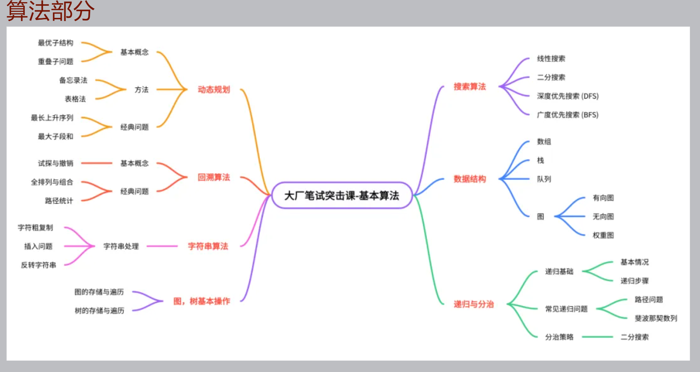

# 华为机考相关笔记(重点DFS\BFS\动态规划)

### 递归

- 70.爬楼梯（55.1%｜简单）
- 112.路径总和（55.2%｜简单）
- 509.斐波那契数（65.9%｜简单）

### 分治

- 23.合并 K 个升序链表（61.6%｜困难）
- 169.多数元素（66.7%｜简单）
- 240.搜索二维矩阵 II（55.3%｜中等）

### 单调栈

- 84.柱状图中最大的矩形（47.1%｜困难）
- 85.最大矩形（55.7%｜困难）
- 739.每日温度（69.5%｜中等）
- 503.下一个更大元素 II（68.6%｜中等）

### 并查集

- 547.省份数量（62.5%｜中等）
- 200.岛屿数量（62.4%｜中等）
- 684.冗余连接（68.5%｜中等）

### 滑动窗口

- 209.长度最小的子数组（47.0%｜中等）
- 3.无重复字符的最长子串（40.9%｜中等）
- 1004.最大连续1的个数 III（60.5%｜中等）
- 1208.尽可能使字符串相等（52.1%｜中等）

### 前缀和

- 724.寻找数组的中心下标（54.5%｜简单）
- 560.和为 K 的子数组（44.8%｜中等）
- 437.路径总和 III（47.6%｜中等）
- 1248.统计「优美子数组」（60.4%｜中等）

### 差分

- 1094.拼车（53.4%｜中等）
- 121.买卖股票的最佳时机（58.5%｜简单）
- 122.买卖股票的最佳时机 II（74.9%｜中等）

### 拓扑排序

- 210.课程表 II（58.8%｜中等）

### 字符串

- 5.最长回文子串（39.3%｜中等）
- 20.有效的括号（44.7%｜简单）
- 43.字符串相乘（44.6%｜中等）
- 93.复原 IP 地址（61.1%｜中等）

### 二分查找

- 33.搜索旋转排序数组（45.0%｜中等）
- 34.在排序数组中查找元素的第一个和最后一个位置（45.0%｜中等）

### BFS

- 127.单词接龙（49.5%｜困难）
- 139.单词拆分（57.8%｜中等）
- 130.被围绕的区域（47.0%｜中等）
- 529.扫雷游戏（64.3%｜中等）
- 815.公交路线（46.9%｜困难）

### DFS & 回溯

- 934.最短的桥（53.1%｜中等）
- 685.冗余连接 II（44.3%｜困难）
- 1102.得分最高的路径（41.6%｜中等）
- 531.孤独像素 I（64.3%｜中等）
- 113.路径总和 II（63.8%｜中等）
- 332.重新安排行程（44.2%｜困难）
- 337.打家劫舍 III（62.1%｜中等）

### 动态规划

- 23.打家劫舍 II（45.6%｜中等）
- 123.买卖股票的最佳时机 III（61.9%｜困难）
- 62.不同路径（69.3%｜中等）
- 63.不同路径 II（42.1%｜中等）
- 361.轰炸敌人（59.7%｜中等）
- 1230.抛掷硬币（55.7%｜中等）

### 贪心算法

- 55.跳跃游戏（43.7%｜中等）
- 435.无重叠区间（52.7%｜中等）
- 621.任务调度器（60.4%｜中等）
- 452.用最少数量的箭引爆气球（52.7%｜中等）

### 字典树

- 820.单词的压缩编码（52.6%｜中等）
- 208.实现 Trie (前缀树)（72.7%｜中等）
- 648.单词替换（63.7%｜中等）